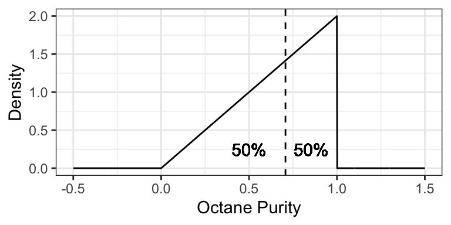

# Distribution Properties: Quantities we can Interpret 

**Caution: in a highly developmental stage! See Section  \@ref(caution).**

__Status__: Topics are mostly all here, but needs framing. Also needs some consolidation. 

Concepts:

- Probabilistic quantities and their interpretation
- Prediction as choosing a probabilistic quantity to put forth.
- Irreducible error


## Probabilistic Quantities

- Sometimes confusingly called "parameters".
- Explain the quantities by their interpretation/usefulness, using examples.
	- Mean: what number would you want if you have 10 weeks worth of data, and you want to estimate the total after 52 weeks (one year)?
	- Mode
	- Quantiles:
- Measures of discrepency/"distance" (for prediction):
    - difference
    - ratio
- Measures of spread:
    - Variance
    - IQR
    - Coefficient of Variance (point to its usefulness on a positive ratio scale)
- Information measures

When you want information about an unknown quantity, it's up to you what you decide to use. 

The mean is the most commonly sought when the unknown is numeric. I suspect this is the case for two main reasons:

1. It simplifies computations.
2. It's what's taught in school.

## Measures of central tendency and uncertainty

There are two concepts when communicating an uncertain outcome:

- __Central tendency__: a "typical" value of the outcome.
- __Uncertainty__: how "random" the outcome is.

There are many ways to _measure_ these two concepts. They're defined using a probability distribution, but just as probability can be defined as the limit of a fraction based on a sample, these measures often have a _sample version_ (aka _empirical version_) from which they are derived. 

As such, let's call $X$ the random outcome, and $X_1, \ldots, X_n$ a set of $n$ _observations_ that form a _sample_ (see the [terminology page](https://ubc-mds.github.io/resources_pages/terminology/#sample) for alternative uses of the word _sample_).

### Mode and Entropy

No matter what scale a distribution has, we can always calculate the mode and entropy. And, when the outcome is categorical (like the Mario Kart example), we are pretty much stuck with these as our choices.

The __mode__ of a distribution is the outcome having highest probability.

- A measure of central tendency.
- The sample version is the observation you saw the most.
- Measured as an _outcome_, not as the probabilities.

The __entropy__ of a distribution is defined as $$-\displaystyle \sum_x P(X=x)\log(P(X=x)).$$

- A measure of uncertainty.
- Probably the only measure that didn't originate from a sample version (comes from information theory).
- Measured as a transformation of probabilities, not as the outcomes -- so, hard to interpret on its own.
- Cannot be negative; zero-entropy means no randomness.

### Mean and Variance

When our outcome is numeric, we can take advantage of the numeric property and calculate the _mean_ and _variance_: 

The __mean__ (aka expected value, or expectation) is defined as $$\displaystyle \sum_x x\cdot P(X=x).$$

- A measure of central tendency, denoted $E(X)$.
- Its sample version is $\bar{X} = \frac{1}{n} \sum_{i=1}^n X_i,$ which gets closer and closer to the true mean as $n \rightarrow \infty$ (this is in fact how the mean is originally defined!)
- Useful if you're wanting to compare _totals_ of a bunch of observations (just multiply the mean by the number of observations to get a sense of the total).
- Probably the most popular measure of central tendency.
- Note that the mean might not be a possible outcome!

The __variance__ is defined as $$E[(X-E(X))^2],$$ or this works out to be equivalent to the (sometimes) more useful form, $$E[X^2]-E[X]^2.$$

- A measure of uncertainty, denoted $\text{Var}(X)$.
- Yes! This is an expectation -- of the squared deviation from the mean.
- Its sample version is $s^2 = \frac{1}{n-1} \sum_{i=1}^n (X_i - \bar{X})^2$, or sometimes $s^2 = \frac{1}{n} \sum_{i=1}^n (X_i - \bar{X})^2$ -- both get closer and closer to the true variance as $n \rightarrow \infty$ (you'll be able to compare the goodness of these at estimating the true variance in DSCI 552 next block). 
- Like entropy, cannot be negative, and a zero variance means no randomness.  
- Unlike entropy, depends on the actual values of the random variable.

The __standard deviation__ is the square root of the variance.

- Useful because it's measured on the same scale as the outcome, as opposed to variance, which takes on squared outcome measurements.


Note: you may have heard of the __median__ -- we'll hold off on this until later.


## What is the mean, anyway?

Imagine trying to predict your total expenses for the next two years. You have monthly expenses listed for the past 12 months. What's one simple way of making your prediction? Calculate the average expense from the past 12 months, and multiply that by 24.

In general, a mean (or expected value) can be interpreted as the _long-run average_. However, the mean tends to be interpreted as a _measure of central tendency_, which has a more nebulous interpretation as a "typical" outcome, or an outcome for which most of the data will be "nearest".

## Quantiles

It's common to "default" to using the mean to make decisions. But, the mean is not always appropriate (I wrote a [blog post](https://vincenzocoia.github.io/20180218-mean/) about this):

- Sometimes it makes sense to relate the outcome to a coin toss.
    - For example, find an amount for which next month's expenditures will either exceed or be under with a 50% chance. 
- Sometimes a conservative/liberal estimate is wanted.
    - For example, a bus company wants conservative estimates so that _most_ busses fall within the estimated travel time. 

In these cases, we care about _quantiles_, not the mean. Estimating them is called __quantile regression__ (as opposed to __mean regression__).

Recall what quantiles are: the $\tau$-quantile (for $\tau$ between 0 and 1) is the number that will be exceeded by the outcome with a $(1-\tau)$ chance. In other words, there is a probability of $\tau$ that the outcome will be _below_ the $\tau$-quantile.

$\tau$ is referred to as the _quantile level_, or sometimes the _quantile index_. 

For example, a bus company might want to predict the 0.8-quantile of transit time -- 80% of busses will get to their destination within that time.


## Continuous Distribution Properties

With continuous random variables, it becomes easier to expand our "toolkit" of the way we describe a distribution / random variable. As before, each property always has a distribution-based definition that gives us an exact/true value, and sometimes has an empirically-based (data-based) definition that gives us an approximate value, but that approaches the true value as more and more observations are collected. 

### Mean, Variance, Mode, and Entropy (5 min)

These are the properties of a distribution that we've already seen, but they do indeed extend to the continuous case. 

Mode and entropy can be defined, but since these ignore the numeric property of continuous random variables, they tend to not be used. Also, these properties don't really have a natural empirical version.

- __Mode__: The outcome having the highest density. That is, $$\text{Mode} = {\arg \max}_x f(x).$$
- __Entropy__: The entropy can be defined by replacing the sum in the finite case with an integral: $$\text{Entropy} = \int_x f(x) \log f(x) \text{d}x.$$ 

Instead, we prefer to describe a continuous random variable using properties that inform us about distances. The mean and variance are two such measures of central tendency and uncertainty, where the only difference with a continuous random variable is in the distribution-based definition, where the sum becomes an integral.

- __Mean__: The distribution-based definition is $$E(X) = \int_x x \, f(x) \text{d}x.$$ 
  - You may later learn that this is a point that is "as close as possible" to a randomly generated outcome, in the sense that its expected squared distance is as small as possible. 
  - Ends up being the "center of mass" of a probability density function, meaning that you could "balance" the density function on this single point without it "toppling over due to gravity".
  - Probably best interpreted as the long-run sample average (empirical mean).
- __Variance__: The distribution-based definition is $$\text{Var}(X) = E \left( (X - \mu_X)^2 \right) = \int_x (x - \mu_X) ^ 2 \, f(x) \text{d}x,$$ where $\mu_X = E(X)$. While the mean minimizes the expected squared distance to a randomly generated outcome, this _is_ the expected squared distance.

Going back to the octane purity example from Low Purity Octane gas station:

- The mode is 1 (the highest purity possible!).
- The entropy works out to be $$\int_0^1 2x \log(2x) \text{d}x \doteq 0.1931.$$
- The mean ends up being not a very good purity (especially as compared to the mode!), and is $$\int_0^1 2x^2 \text{d}x = \frac{2}{3}.$$
- The variance ends up being $$\int_0^1 2 x \left(x - \frac{2}{3}\right)^2 \text{d}x = \frac{1}{18}.$$

### Median (5 min)

The median is the outcome for which there's a 50-50 chance of seeing a greater or lesser value. So, its distribution-based definition satisfies 
$$P(X \leq \text{Median}(X)) = 0.5.$$ 
Its empirically-based definition is the "middle value" after sorting the outcomes from left-to-right. 

Similar to the mean, you may later learn that the median is a point that is "as close as possible" to a randomly generated outcome, in the sense that its expected _absolute_ distance is as small as possible.

The median is perhaps best for making a single decision about a random outcome. Making a decision is simplest when the possibilities are reduced down to two equally likely outcomes, and this is exactly what the median does. For example, if the median time it takes to complete a hike is 2 hours, then you know that there's a 50-50 chance that the hike will take over 2 hours. If you're instead told that the mean is 2 hours, this only tells us that the total amount of hiking time done by a bunch of people will be as if everyone takes 2 hours to do the hike -- this is still useful for making a decision about whether or not you should do the hike, but is more convoluted. 

Using the purity example at Low Purity Octane, the median is about 0.7071:




### Quantiles (5 min)

More general than a median is a _quantile_. The definition of a $p$-quantile $Q(p)$ is the outcome that has a $1-p$ probability of exceedance, or equivalently, for which there's a probability $p$ of getting a smaller outcome. So, its distribution-based definition satisfies 
$$P(X \leq Q(p)) = p.$$ 
The median is a special case, and is the 0.5-quantile.

An empirically-based definition of the $p$-quantile is the $np$'th largest (rounded up) observation in a sample of size $n$.

Some quantiles have a special name:

- The 0.25-, 0.5-, and 0.75-quantiles are called _quartiles_.
	- Sometimes named the first, second, and third quartiles, respectively.
- The 0.01-, 0.02, ..., and 0.99-quantiles are called _percentiles_.
	- Sometimes the $p$-quantile will be called the $100p$'th percentile; for example, the 40th percentile is the 0.4-quantile.
- Less commonly, there are even _deciles_, as the 0.1, 0.2, ..., and 0.9-quantiles.

For example, the 0.25-quantile of octane purity at Low Purity Octane is 0.5, since the area to the left of 0.5 is 0.25:


### Prediction Intervals (5 min)

It's often useful to communicate an interval for which a random outcome will fall in with a pre-specified probability $p$. Such an interval is called a $p \times 100\%$ __Prediction Interval__. 

Usually, we set this up in such a way that there's a $p/2$ chance of exceeding the interval, and $p/2$ chance of undershooting the interval. You can calculate the lower limit of this interval as the $(1 - p)/2$-Quantile, and the upper limit as the $1 - (1 - p)/2$-Quantile.

__Example__: a 90% prediction interval for the purity of gasoline at "Low Purity Octane" is [0.2236, 0.9746], composed of the 0.05- and 0.95-quantiles. 


### Skewness (5 min)

Skewness measures how "lopsided" a distribution is, as well as the direction of the skew. 

- If the density is symmetric about a point, then the skewness is 0.
- If the density is more "spread-out" towards the right / positive values, then the distribution is said to be _right-skewed_ (positive skewness).
- If the density is more "spread-out" towards the left / negative values, then the distribution is said to be _left-skewed_ (negative skewness).


It turns out that for symmetric distributions, the _mean and median_ are equivalent. But otherwise, the mean tends to be further into the skewed part of the distribution. Using the monthly expense example, the mean monthly expense is \$3377.87, which is bigger than the median monthly expense of \$2980.96.


Formally, skewness can be defined as 
$$\text{Skewness} = E \left( \left( \frac{X - \mu_X}{\sigma_X} \right) ^ 3 \right),$$
where $\mu_X = E(X)$ and $\sigma_X = \text{SD}(X)$.

For example, the octane purity distribution is left-skewed, and has a skewness of $$\int_0^1 2  x  \left(\sqrt{18} (x - 2/3) \right) ^ 3 \text{d}x \doteq -0.5657.$$

### Examples

For the following situations, which quantity is most appropriate, and why?

- You want to know your monthly expenses in the long run (say, for forecasting net gains after many months). How do you communicate total expense?
- You want to ensure you put enough money aside on a given month to ensure you'll have enough money to pay your bills. How much should you put aside?
- How should you communicate the cost of a typical house in North Vancouver?

## Heavy-Tailed Distributions


Consider the weekly returns of the Singapore Straights (STI) market, depicted by the following histogram. You'll notice some extreme values that are far from the "bulk" of the data. 


Traditional practice was to view these extremes as "outliers" that are a nuisance for analysis, and therefore should be removed. But this can actually be detrimental to the analysis, because these outliers are real occurences that should be anticipated. 

Instead, __Extreme Value Analysis__ is a practice that tries to get a sense of how big and how frequently extremes will happen.

### Sensitivity of the mean to extremes

Indeed, the empirical (arithmetic) mean is sensitive to outliers: consider the sample average of 100 observations coming from a N(0,1) distribution:


```r
set.seed(6)
n <- 50
x <- rnorm(n)
mean(x)
```

```
## [1] 0.08668773
```

Here's that mean depicted on a histogram of the data:


Now consider calculating the mean by replacing the last observation with 50 (a very large number):


```r
x[n] <- 50
mean(x)
```

```
## [1] 1.082927
```

This is a big difference made by a single observation! Let's take a look at the histogram now (outlier not shown). The "old" mean is the thin vertical line:


There are [robust and/or resistant ways of estimating the mean](https://en.wikipedia.org/wiki/Robust_statistics#Estimation_of_location) that are less sensitive to the outliers. But what's more interesting when you have extreme values in your data is to get a sense of how frequently extremes will happen, and the mean won't give you that sense. 

### Heavy-tailed Distributions

Distributions known as __heavy-tailed distributions__ give rise to extreme values. These are distributions whose tail(s) decay like a power decay. The slower the decay, the heavier the tail is, and the more prone extreme values are.

For example, consider the member of the Pareto Type I family of distributions with survival function $S(x) = 1/x$ for $x \geq 1$. Here is this distribution compared to an Exponential(1) distribution (shifted to start at $x=1$):


Notice that the Exponential survival function becomes essentially zero very quickly, whereas there's still lots of probability well into the tail of the Pareto distribution.  

Also note that if a distribution's tail is "too heavy", then its mean will not exist! For example, the above Pareto distribution has no mean.

### Heavy-tailed distribution families

Here are some main families that include heavy-tailed distributions:

- Family of [Generalized Pareto distributions](https://en.wikipedia.org/wiki/Generalized_Pareto_distribution)
- Family of [Generalized Extreme Value distributions](https://en.wikipedia.org/wiki/Generalized_extreme_value_distribution)
- Family of [Student's _t_ distributions](https://en.wikipedia.org/wiki/Student%27s_t-distribution)
	- The Cauchy distribution is a special case of this.

### Extreme Value Analysis

There are two key approaches in Extreme Value Analysis:

- _Model the tail_ of a distribution using a theoretical model. That is, choose some `x` value, and model the distribution _beyond_ that point. It turns out a [Generalized Pareto distribution](https://en.wikipedia.org/wiki/Generalized_Pareto_distribution) is theoretically justified.
- The _peaks over thresholds_ method models the extreme observations occurring in a defined window of time. For example, the largest river flows each year. It turns out a [Generalized Extreme Value distribution](https://en.wikipedia.org/wiki/Generalized_extreme_value_distribution) is theoretically justified here. 

### Multivariate Student's _t_ distributions

Just like there's a multivariate Gaussian distribution, there's also a multivariate Student's _t_ distribution. And in fact, its contours are elliptical, too!

Here's a comparison of a bivariate Gaussian and a bivariate Student's _t_ distribution, both of which are elliptical. One major difference is that a sample from a bivariate Gaussian distribution tends to be tightly packed, whereas data from a bivariate Student's _t_ distribution is prone to data deviating far from the main "data cloud". 


And here are samples coming from these two distributions. Notice how tightly bundled the Gaussian distribution is compared to the _t_ distribution!


