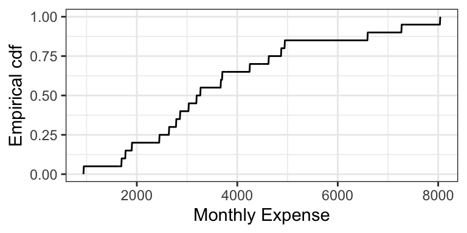

# Explaining an uncertain outcome: interpretable quantities

**Caution: in a highly developmental stage! See Section  \@ref(caution).**

So far, we've been saying that a pmf or a pdf is a distribution. Actually, there are more ways we can depict a distribution aside from the pmf/pdf. This section takes a deeper dive into alternative ways a probability distribution can be depicted, and their usefulness. Keep in mind that all of these depictions capture _everything_ about a distribution, which means that if one of them is given, then the other ones can be derived.

__A note on depictions of multivariate distributions__: There _is_ such thing as a multivariate cdf. It comes in handy in copula theory, which is an optional question in a lab assignment. But otherwise, it's not as useful as a multivariate _density_, so we won't cover it. And, there's no such thing as a multivariate quantile function.

### Cumulative Density Functions (cdf's) / Distribution Functions

The __cdf__ is usually denoted by $F$, and is defined as $$F(x) = P(X \leq x).$$ We can calculate this using a density $f$ by $$F(x) = \int_{-\infty}^x f(t) \, \text{d}t.$$

Unlike the pdf/pmf, the cdf always exists for any random variable. It just doesn't exist for categorical variables, because there's no such thing as "less than" or "greater than". For discrete random variables, the cdf is still a continuous function, but has a jump-discontinuity at the discrete values. 

Here are the cdf's of the octane purity, monthly expenses, and length of stay (from last time):

For the discrete cdf, a hollow point is a limiting point -- the cdf does not evaluate to that point. Note that usually jump discontinuities in a cdf are connected with a straight vertical line, which we will do from now on after this plot.

In order for a function $F$ to be a valid cdf, the function needs to satisfy the following requirements:

1. Must never decrease.
2. It must never evalute to be <0 or >1.
3. $F(x) \rightarrow 0$ as $x \rightarrow -\infty$
4. $F(x) \rightarrow 1$ as $x \rightarrow \infty$.

The _empirical cdf_ (ecdf) for a sample of size $n$ treats the sample as if they are discrete values, each with probability $1/n$. Like the cdf of a discrete random variable, the ecdf is also a "step function". Here is the empirical cdf for the sample of 20 monthly expenses:

#### Exercise (10 min)

On the board, let's calculate the cdf's of the following two distributions (that you've seen in lab):
$$X \sim \text{Discrete Uniform}(0, 4)$$
$$Y \sim \text{Continuous Uniform}(0, 4)$$

#### Evaluating Properties using the cdf (5 min)

It turns out that the mean can be calculated in a fairly simple way from the cdf. It's the area above the cdf and to the right of $x = 0$, _minus_ the area below the cdf and to the left of $x = 0$.

In-class exercise: the cdf of octane purity is 
$$
F_{\text{Purity}}(x) = 
\begin{cases}
  0, \: x < 0\\
  x^2, \: 0 \leq x \leq 1, \\
  1, \: x > 1.
\end{cases}
$$

1. What is $P(0.5 < \text{Octane} < 0.75)$?
2. What is $P(0.5 < \text{Octane} \leq 0.75)$?
3. What is $P(\text{Octane} > 0.75)$?
4. What is the median? 0.25-quantile?
5. True or False: knowing the density of a distribution means that we also know the cdf; but knowing the cdf does not imply knowing the density.

### Survival Function (2 min)

The __survival function__ $S$ is just the cdf "flipped upside down". For random variable $X$, the survival function is defined as
$$S(x) = P(X > x) = 1 - F(x).$$

The name comes from Survival Analysis (covered in DSCI 562), where $X$ is interpreted as a "time of death", so that the survival function is the probability of surviving beyond $x$. Aside from Survival Analysis, the survival function is also useful for Extreme Value Theory.

Here are the survival functions of our three examples:

### Quantile Function (5 min)

The __quantile function__ $Q$ takes a probability $p$ and maps it to the $p$-quantile. It turns out that this is the inverse of the cdf!
$$Q(p) = F^{-1}(p)$$

Note that this function does not exist outside of $0 \leq p \leq 1$! This is unlike the other functions (density, cdf, and survival function), which exist on all real numbers. 

Here are the quantile functions of the examples we are working with:

### Other ways of depicting a distribution (Optional) (1 min)

There are even more ways to depict a distribution that we won't be going into, that you might have heard of. Denote $X$ as a random variable. Some are:

- Moment generating function (useful in mathematical statistics): $$M(t) = E(e^{Xt})$$
- Characteristic function (useful in mathematical statistics): $$\chi(t) = E(e^{Xti}),$$ where $i^2=1$.
- Hazard function (useful in survival analysis; wait for DSCI 562): $$h(t) = \frac{f(t)}{S(t)}$$

