# Prediction: harnessing the signal {-}

# Reducing uncertainty of the outcome: conditional distributions


## Conditional Distributions

Probability distributions describe an uncertain outcome, but what if we have partial information?

Consider the example of ships arriving at the port of Vancouver again. Each ship will stay at port for a random number of days, which we'll call the _length of stay_ (LOS) or $D$, according to the following (made up) distribution:


| Length of Stay (LOS)| Probability|
|--------------------:|-----------:|
|                    1|        0.25|
|                    2|        0.35|
|                    3|        0.20|
|                    4|        0.10|
|                    5|        0.10|


Suppose a ship has been at port for 2 days now, and it'll be staying longer. What's the distribution of length-of-stay now? Using symbols, this is written as $P(D = d \mid D > 2)$, where the bar "|" reads as "given" or "conditional on", and this distribution is called a __conditional distribution__. We can calculate a conditional distribution in two ways: a "table approach" and a "formula approach".

__Table approach__:

1. Subset the pmf table to only those outcomes that satisfy the _condition_ ($D > 2$ in this case). You'll end up with a "sub table".
2. Re-normalize the remaining probabilities so that they add up to 1. You'll end up with the _conditional distribution_ under that condition.

__Formula approach__: In general for events $A$ and $B$, the conditional probability formula is $$P(A \mid B) = \frac{P(A \cap B)}{P(B)}.$$ 

For the ship example, the event $A$ is $D = d$ (for all possible $d$'s), and the event $B$ is $D > 2$. Plugging this in, we get 
$$P(D = d \mid D > 2) = \frac{P(D = d \cap D > 2)}{P(D > 2)} = \frac{P(D = d)}{P(D > 2)} \text{ for } d = 3,4,5.$$

The only real "trick" is the numerator. How did we reduce the convoluted event $D = d \cap D > 2$ to the simple event $D = d$ for $d = 3,4,5$? The trick is to go through all outcomes and check which ones satisfy the requirement $D = d \cap D > 2$. This reduces to $D = d$, as long as $d = 3,4,5$.

## Joint Distributions

So far we've only considered one random variable at a time. Its distribution is called *univariate* because there's just one variable. But, we very often have more than one random variable. 

Let's start by considering ... We can visualize this as a _joint distribution_:


Don't be fooled, though! This is not really any different from what we've already seen. We can still write this a univariate distribution with four categories. This is useful to remember when we're calculating probabilities.

| Outcome | Probability |
|------|------|
| `HH` | 0.25 |
| `HT` | 0.25 |
| `TH` | 0.25 |
| `TT` | 0.25 |

Viewing the distribution as a (2-dimensional) matrix instead of a (1-dimensional) vector turns out to be more useful when determining properties of individual random variables.

### Example: Length of Stay vs. Gang Demand

Throughout today's class, we'll be working with the following joint distribution of _length of stay_ of a ship, and its _gang demand_. 


|            | Gangs = 1| Gangs = 2| Gangs = 3| Gangs = 4|
|:-----------|---------:|---------:|---------:|---------:|
|__LOS = 1__ |    0.0017|    0.0425|    0.1247|    0.0811|
|__LOS = 2__ |    0.0266|    0.1698|    0.1360|    0.0176|
|__LOS = 3__ |    0.0511|    0.1156|    0.0320|    0.0013|
|__LOS = 4__ |    0.0465|    0.0474|    0.0059|    0.0001|
|__LOS = 5__ |    0.0740|    0.0246|    0.0014|    0.0000|

The joint distribution is stored in "tidy format" in an R variable named `j`:


```{=html}
<div id="htmlwidget-d69f16e91aa135583c96" style="width:100%;height:auto;" class="datatables html-widget"></div>
<script type="application/json" data-for="htmlwidget-d69f16e91aa135583c96">{"x":{"filter":"none","vertical":false,"data":[[1,1,1,1,2,2,2,2,3,3,3,3,4,4,4,4,5,5,5,5],[1,2,3,4,1,2,3,4,1,2,3,4,1,2,3,4,1,2,3,4],[0.00169521499491428,0.0425290281772713,0.124711273848748,0.0810644829790661,0.0266383589439578,0.169814374583795,0.135975485931834,0.0175717805404135,0.0510939809850838,0.115627245345243,0.0320251247337617,0.0012536489359114,0.0465298193710262,0.047435714079229,0.00593496234303592,9.95042067087892e-05,0.0740426257050178,0.0245936378144616,0.00135315314262041,1.05833379001607e-05]],"container":"<table class=\"display\">\n  <thead>\n    <tr>\n      <th>los<\/th>\n      <th>gang<\/th>\n      <th>p<\/th>\n    <\/tr>\n  <\/thead>\n<\/table>","options":{"columnDefs":[{"className":"dt-right","targets":[0,1,2]}],"order":[],"autoWidth":false,"orderClasses":false}},"evals":[],"jsHooks":[]}</script>
```

### Marginal Distributions

We've just specified a joint distribution of _length of stay_ and _gang request_. But, we've previously specified a distribution for these variables individually. These are not things that can be specified separately:

- If you have a joint distribution, then the distribution of each individual variable follows as a consequence.
- If you have the distribution of each individual variable, you still don't have enough information to form the joint distribution between the variables.

The distribution of an individual variable is called the __marginal distribution__ (sometimes just "marginal" or "margin"). The word "marginal" is not really needed when we're talking about a random variable -- there's no difference between the "marginal distribution of length of stay" and the "distribution of length of stay", we just use the word "marginal" if we want to emphasize the distribution is being considered _in isolation_ from other related variables. 

### Calculating Marginals from the Joint

There's no special way of calculating a marginal distribution from a joint distribution. As usual, it just involves adding up the probabilities corresponding to relevant outcomes.

For example, to compute the marginal distribution of length of stay (LOS), we'll first need to calculate $P(\text{LOS} = 1)$. Using the joint distribution of _length of stay_ and _gang request_, the outcomes that satisfy this requirement are the entire first row of the probability table. 
It follows that the marginal distribution of LOS can be obtained by adding up each row. For the marginal of gang requests, just add up the columns.

Here's the marginal of LOS (don't worry about the code, you'll learn more about this code in DSCI 523 next block). Notice that the distribution of LOS is the same as before!


| Length of Stay| Probability|
|--------------:|-----------:|
|              1|        0.25|
|              2|        0.35|
|              3|        0.20|
|              4|        0.10|
|              5|        0.10|

Similarly, the distribution of gang request is the same as from last lecture:


| Gang request| Probability|
|------------:|-----------:|
|            1|         0.2|
|            2|         0.4|
|            3|         0.3|
|            4|         0.1|

### Conditioning on one Variable

What's usually more interesting than a joint distribution are conditional distributions, when other variables are fixed. This is a special type of conditional distribution and an extremely important type of distribution in data science. 

For example, a ship is arriving, and they've told you they'll only be staying for 1 day. What's the distribution of their gang demand under this information? That is, what is $P(\text{gang} = g \mid \text{LOS} = 1)$ for all possible $g$?

__Table approach__:

1. Isolating the outcomes satisfying the condition ($\text{LOS} = 1$), we obtain the first row:


| Gangs: 1| Gangs: 2| Gangs: 3| Gangs: 4|
|--------:|--------:|--------:|--------:|
|   0.0017|   0.0425|   0.1247|   0.0811|

2. Now, re-normalize the probabilities so that they add up to 1, by dividing them by their sum, which is 0.25:


| Gangs: 1| Gangs: 2| Gangs: 3| Gangs: 4|
|--------:|--------:|--------:|--------:|
|   0.0068|   0.1701|   0.4988|   0.3243|

__Formula Approach__: Applying the formula for conditional probabilities, we get 
$$P(\text{gang} = g \mid \text{LOS} = 1) = \frac{P(\text{gang} = g, \text{LOS} = 1)}{P(\text{LOS} = 1)},$$
which is exactly row 1 divided by 0.25.

Here's a plot of this distribution. For comparison, we've also reproduced its marginal distribution.

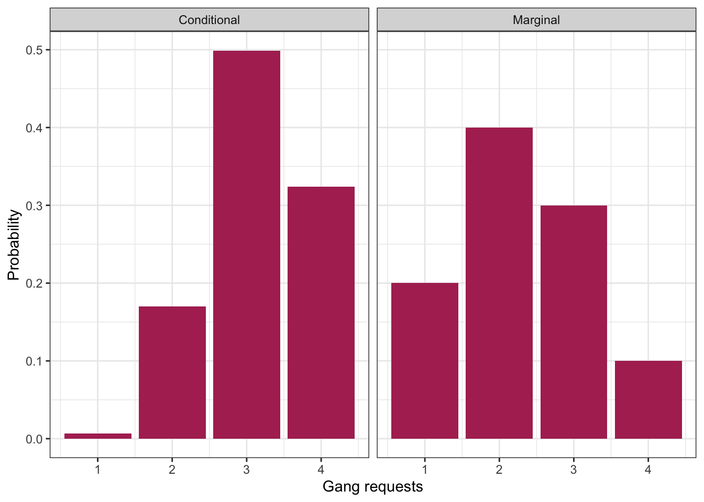

Interpretation: given information, about length of stay, we get an updated picture of the distribution of gang requests. Useful for decision making!

### Law of Total Probability/Expectation

Quite often, we know the conditional distributions, but don't directly have the marginals. In fact, most of regression and machine learning is about seeking conditional means!

For example, suppose you have the following conditional means of gang request given the length of stay of a ship.

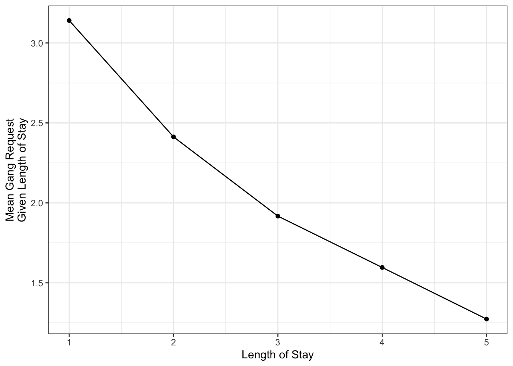

This curve is called a __model function__, and is useful if we want to predict a ship's daily gang request if we know their length of stay. But what if we don't know their length of stay, and we want to produce an expected gang request? We can use the marginal mean of gang request!

In general, a marginal mean can be computed from the _conditional means_ and the _probabilities of the conditioning variable_. The formula, known as the __law of total expectation__, is
$$E(Y) = \sum_x E(Y \mid X = x) P(X = x).$$

Here's a table that outlines the relevant values:


| Length of Stay (LOS)| E(Gang &#124; LOS)| P(LOS)|
|--------------------:|------------------:|------:|
|                    1|           3.140580|   0.25|
|                    2|           2.412802|   0.35|
|                    3|           1.917192|   0.20|
|                    4|           1.596041|   0.10|
|                    5|           1.273317|   0.10|

Multiplying the last two columns together, and summing, gives us the marginal expectation: 2.3.

Also, remember that probabilities are just means, so the result extends to probabilities:
$$P(Y = y) = \sum_x P(Y = y \mid X = x) P(X = x)$$
This is actually a generalization of the law of total probability we saw before: $P(Y=y)=\sum_x P(Y = y, X = x)$.

### Exercises

In pairs, come to a consensus with the following three questions.

1. Given the conditional means of gang requests, and the marginal probabilities of LOS in the above table, what's the expected gang requests, given that the ship captain says they won't be at port any longer than 2 days? In symbols, $$E(\text{Gang} \mid \text{LOS} \leq 2).$$

2. What's the probability that a new ship's _total_ gang demand equals 4? In symbols, $$P(\text{Gang} \times \text{LOS} = 4).$$

3. What's the probability that a new ship's _total_ gang demand equals 4, given that the ship won't stay any longer than 2 days? In symbols, $$P(\text{Gang} \times \text{LOS} = 4 \mid \text{LOS} \leq 2).$$


## Multivariate Densities/pdf's

Recall the joint _pmf_ (discrete) from Lecture 4, between gang demand and length-of-stay:


|            | Gangs = 1| Gangs = 2| Gangs = 3| Gangs = 4|
|:-----------|---------:|---------:|---------:|---------:|
|__LOS = 1__ |    0.0017|    0.0425|    0.1247|    0.0811|
|__LOS = 2__ |    0.0266|    0.1698|    0.1360|    0.0176|
|__LOS = 3__ |    0.0511|    0.1156|    0.0320|    0.0013|
|__LOS = 4__ |    0.0465|    0.0474|    0.0059|    0.0001|
|__LOS = 5__ |    0.0740|    0.0246|    0.0014|    0.0000|

Each entry in the table corresponds to the probability of that unique row (LOS value) and column (Gang value). These probabilities add to 1.

For the _continuous_ case, instead of rows and columns, we have an x- and y-axis for our two variables, defining a region of possible values. For example, if two marathon runners can only finish a marathon between 5.0 and 5.5 hours each, and their end times are totally random, then the possible values are indicated by a square in the following plot:

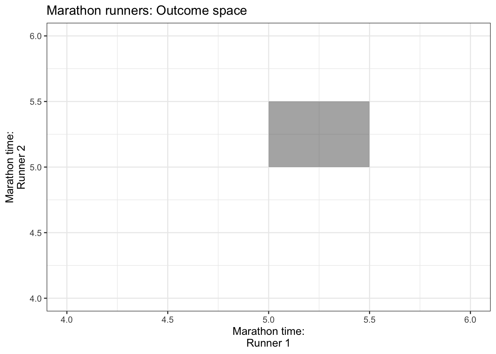

Each point in the square is like an entry in the joint pmf table in the discrete case, except now instead of holding a probability, it holds a _density_. The density _function_, then, is a _surface_ overtop of this square (or in general, the outcome space). That is, it's a function that takes two variables (marathon time for Runner 1 and Runner 2), and calculates a single density value from those two points. This function is called a __bivariate density function__.

Here's an example of what a 2D pdf might look like: https://scipython.com/blog/visualizing-the-bivariate-gaussian-distribution/

__Notation__: For two random variables $X$ and $Y$, their joint density/pdf evaluated at the points $x$ and $y$ is usually denoted
$$f_{X,Y}(x,y),$$
or sometimes less rigorously, as just
$$f(x, y).$$

### Conditional Distributions, revisited 

Remember the formula for conditional probabilities: for events $A$ and $B$,
$$P(A \mid B) = \frac{P(A \cap B)}{P(B)}.$$
But, this is only true if $P(B) \neq 0$, and it's not useful if $P(A) = 0$ -- two situations we're faced with in the continuous world!

#### When $P(A) = 0$

To describe this situation, let's use a univariate continuous example: the example of monthly expenses. 

Suppose the month is half-way over, and you find that you only have \$2500 worth of expenses so far! What's the distribution of this month's total expenditures now, given this information? If we use the law of conditional probability, we would get a formula that's not useful: letting $X = \text{Expense}$,
$$P(X = x \mid X \geq 2500) = \frac{P(X = x)}{P(X \geq 2500)} \ \ \ \text{(no!)}$$

This is no good, because the outcome $x$ has a probability of 0. This equation just simplies to 0 = 0, which is not useful.

Instead, in general, we replace probabilities with densities. In this case, what we actually have is:
$$f(x \mid X \geq 2500) = \frac{f(x)}{P(X \geq 2500)} \ \text{ for } x \geq 2500,$$
and $f(x \mid X \geq 2500) = 0$ for $x < 2500$.

Notice from the formula that the resulting density is just the original density confined to $x \geq 2500$, and re-normalized to have area 1. This is what we did in the discrete case!

The monthly expense example has expenditures $X \sim$ LN(8, 0.5). Here is its marginal distribution and the conditional distribution. Notice the conditional distribution is just a segment of the marginal, and then re-normalized to have area 1.

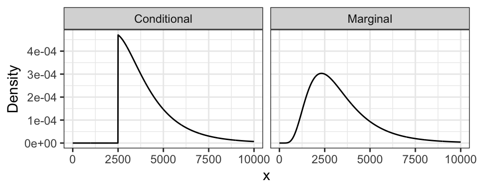

#### When $P(B) = 0$

To describe this situation, let's use the marathon runners' example again. 

Runner 1 ended up finishing in 5.2 hours. What's the distribution of Runner 2's time? Letting $X$ be the time for Runner 1, and $Y$ for Runner 2, we're asking for $f_{Y|X}(y \mid X = 5.2)$.

But wait! Didn't we say earlier that $P(X = 5.2) = 0$? This is the bizarre nature of continuous random variables. Although no outcome is possible, we must observe some outcome in the end. In this case, the stopwatch used to calculate run time has rounded the true run time to 5.2h, even though in reality, it would have been something like 5.2133843789373... hours.

As before, plugging in the formula for conditional probabilities won't work. But, as the case when $P(A) = 0$, we can in general replace probabilities with densities. We end up with
$$f_{Y|X}(y \mid 5.2) = \frac{f_{Y,X}(y, 5.2)}{f_X(5.2)}.$$

This formula is true in general
$$f_{Y|X}(y \mid x) = \frac{f_{Y,X}(y, x)}{f_X(x)}.$$
In fact, this formula is even true for both pdf's and pmf's!


## Dependence concepts

A big part of data science is about harvesting the relationship between $X$ and $Y$, often called the _dependence_ between $X$ and $Y$.

### Independence

Informally, $X$ and $Y$ are __independent__ if knowing something about one tells us nothing about the other.

Formally, the definition of $X$ and $Y$ being independent is: 
$$P(X = x \cap Y = y) = P(X = x) P(Y = y).$$ More usefully and intuitively, it's better to think of independence such that conditioning on an independent variable tells us nothing:

$$P(Y = y \mid X = x) = P(Y = y).$$

This is far less interesting than when there's dependence, which implies that there are relationships between variables. 

### Measures of dependence

When there is dependence, it's often useful to measure the strength of dependence. Here are some measurements. 

#### Covariance and Pearson's Correlation

__Covariance__ is one common way of measuring dependence between two random variables. The idea is to take the average "signed area" of rectangles constructed between a sampled point and the mean, with the sign being determined by "concordance" relative to the mean:

- Concordant means $x < \mu_x$ and $y < \mu_y$, OR $x > \mu_x$ and $y > \mu_y$ -- gets positive area.
- Discordant means $x < \mu_x$ and $y > \mu_y$, OR $x > \mu_x$ and $y < \mu_y$ -- gets negative area. 

Here is a random sample of 10 points, with the 10 rectangles constructed with respect to the mean. Sign is indicated by colour. The covariance is the mean signed area.

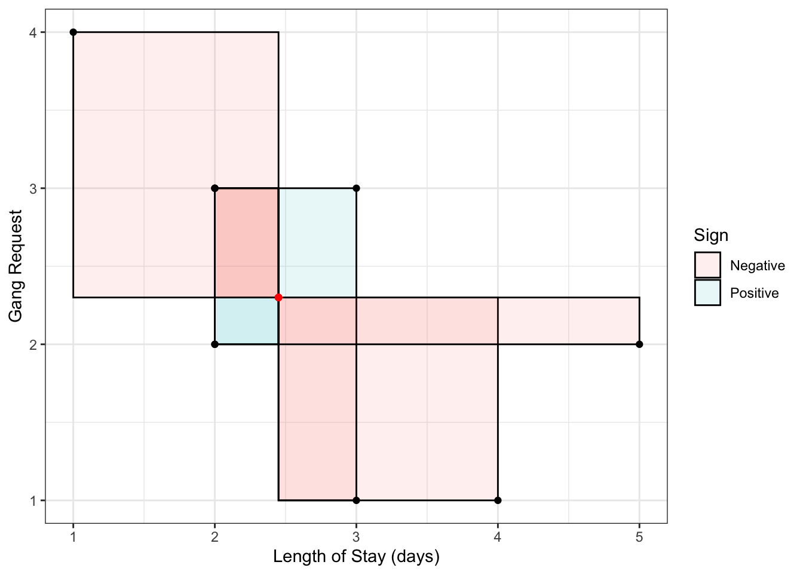

Formally, the definition is
$$\mathrm{Cov(X, Y)} = E[(X-\mu_X)(Y-\mu_Y)],$$
where $\mu_Y=E(Y)$ and $\mu_X=E(X)$. This reduces to a more convenient form,
$$\text{Cov}(X,Y)=E(XY)-E(X)E(Y)$$

In R, you can calculate the empirical covariance using the `cov` function:


```
## [1] -0.7111111
```

In the above example, the boxes are more often negative, so the covariance (and the "direction of dependence") is negative. For the above example, the larger the LOS, the smaller the gang demand -- this inverse relationship is indicative of negative covariance. Other interpretations of the sign:

- Positive covariance indicates that an increase in one variable is associated with an increase in the other variable. 
- Zero covariance indicates that there is no _linear_ trend -- but this does not necessarily mean that $X$ and $Y$ are independent!

It turns out covariance by itself isn't very interpretable, because it depends on the scale (actually, spread) of $X$ and $Y$. For example, multiply $X$ by 10, and suddenly the box sizes increase by a factor of 10, too, influencing the covariance. 

__Pearson's correlation__ fixes the scale problem by standardizing the distances according to standard deviations $\sigma_X$ and $\sigma_Y$, defined as
$$\text{Corr}(X, Y)
= E\left[ 
   \left(\frac{X-\mu_X}{\sigma_X}\right) 
   \left(\frac{Y-\mu_Y}{\sigma_Y}\right)
 \right] 
=\frac{\text{Cov}(X, Y)}{\sqrt{\text{Var}(X)\text{Var}(Y)}}.$$
As a result, it turns out that
$$-1 \leq \text{Corr}(X, Y) \leq 1.$$

The Pearson's correlation measures the _strength of **linear** dependence_:

- -1 means perfect negative linear relationship between $X$ and $Y$.
- 0 means no linear relationship (Note: this does not mean independent!)
- 1 means perfect positive linear relationship.

In R, you can calculate the empirical Pearson's correlation using the `cor` function:


```
## [1] -0.6270894
```

Pearson's correlation is ubiquitous, and is often what is meant when "correlation" is referred to.


#### Kendall's tau

Although Pearson's correlation is ubiquitous, its forced adherance to measuring _linear_ dependence is a big downfall, especially because many relationships between real world variables are not linear.

An improvement is __Kendall's tau__ ($\tau_K$):

- Instead of measuring concordance between each observation $(x, y)$ and the mean $(\mu_x, \mu_y)$, it measures concordance between each _pair_ of observation $(x_i, y_i)$ and $(x_j, y_j)$.
- Instead of averaging the area of the boxes, it averages the amount of concordance and discordance by taking the difference between number of concordant and number of discordant pairs.

Visually plotting the $10 \choose 2$ boxes for the above sample from the previous section:

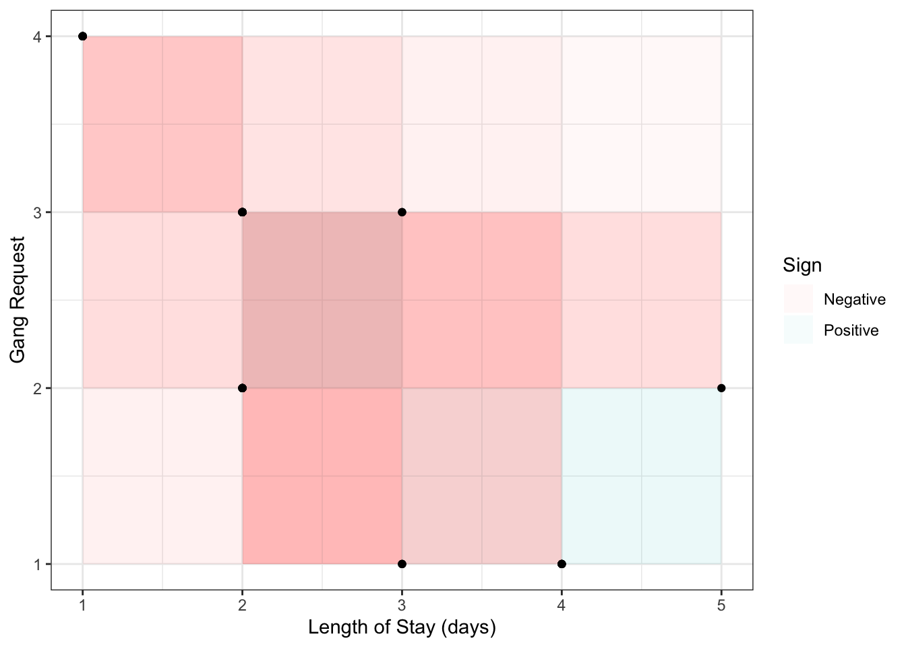

The formal definition is
$$\frac{\text{Number of concordant pairs} - \text{Number of discordant pairs}}{{n \choose 2}},$$
with the "true" Kendall's tau value obtainined by sending $n \rightarrow \infty$. Note that several ways have been proposed for dealing with ties, but this doesn't matter when we're dealing with continuous variables (Weeks 3 and 4).

In R, the empirical version can be calculated using the `cor()` function with `method = "kendall"`:


```
## [1] -0.579771
```

Like Pearson's correlation, Kendall's tau is also between -1 and 1, and also measures strength (and direction) of dependence.

For example, consider the two correlation measures for the following data set. Note that the empirical Pearson's correlation for the following data is not 1!

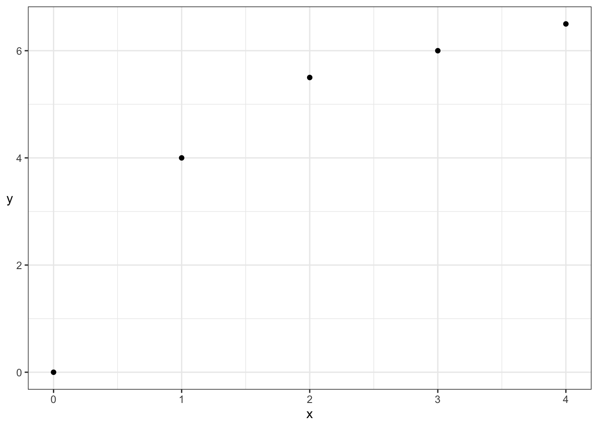


| Pearson| Kendall|
|-------:|-------:|
|  0.9013|       1|


But, Kendall's tau still only measures the strength of _monotonic dependence_. This means that patterns like a parabola, which are not monotonically increasing or decreasing, will not be captured by Kendall's tau either:

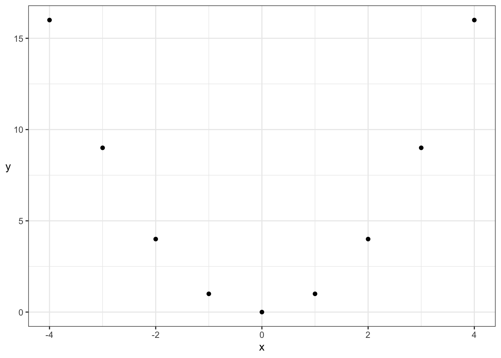


| Pearson| Kendall|
|-------:|-------:|
|       0|       0|

Even though both dependence measures are 0, there's actually deterministic dependence here ($X$ _determines_ $Y$). But, luckily, there are many monotonic relationships in practice, making Kendall's tau a very useful measure of dependence. 

### Dependence as separate from the marginals 

The amount of monotonic dependence in a joint distribution, as measured by kendall's tau, has _nothing to do with the marginal distributions_. This can be a mind-boggling phenomenon, so don't fret if you need to think this over several times. 

To demonstrate, here are joint distributions between LOS and gang demand having the same marginals, but different amounts of dependence. 

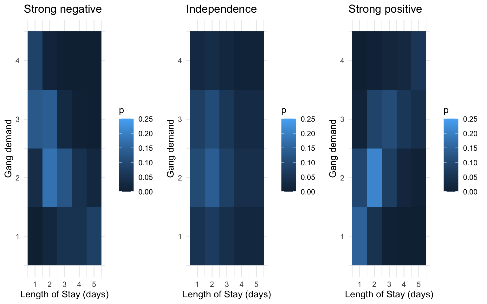


### Dependence as giving us more information 

Let's return to the computation of the conditional distribution of gang requests given that a ship will only stay at port for one day. Let's compare the marginal distribution (the case where we know nothing) to the conditional distributions _for different levels of dependence_ (like we saw in the previous section). The means for each distribution are indicated as a vertical line: 


```
## `summarise()` has grouped output by 'dep'. You can override using the `.groups` argument.
```

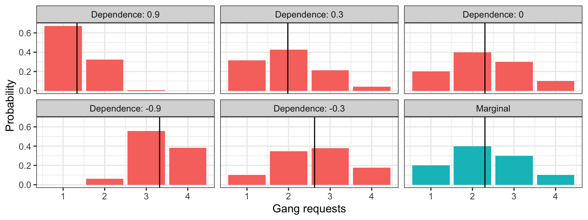

What's of particular importance is comparing the _uncertainty_ in these distributions. Let's look at how the uncertainty measurements compare between marginal and conditional distributions (marginal measurements indicated as horizontal line):

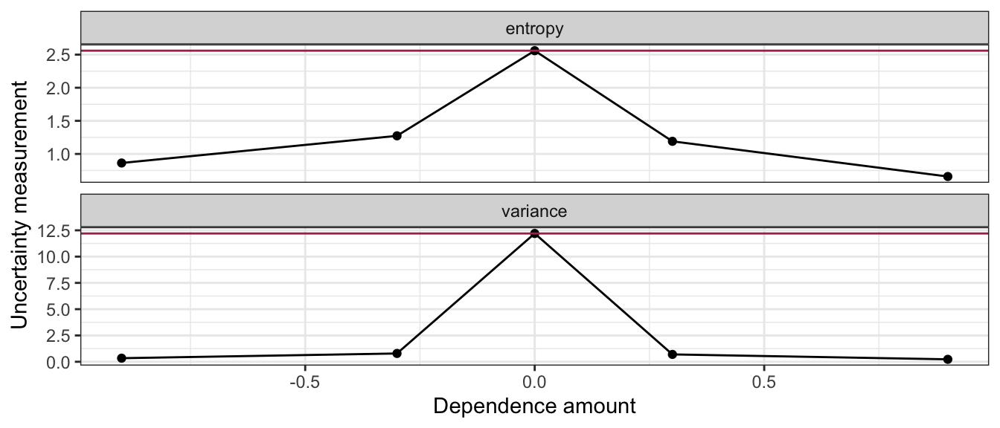

Moral of the story: more dependence (in either direction) gives us more certainty in the conditional distributions! This makes intuitive sense, because the more related $X$ and $Y$ are, the more that knowing what $X$ is will inform what $Y$ is.


## Harvesting Dependence

The opposite of independence is _dependence_: when knowing something about $X$ tells us something about $Y$ (or vice versa). Extracting this "signal" that $X$ contains about $Y$ is at the heart of supervised learning (regression and classification), covered in DSCI 571/561 and beyond.

Usually, we reserve the letter $X$ to be the variable that we know something about (usually an exact value), and $Y$ to be the variable that we want to learn about. These variables [go by many names](https://ubc-mds.github.io/resources_pages/terminology/#equivalence-classes) -- usually, $Y$ is called the __response variable__, and $X$ is sometimes called a __feature__, or __explanatory variable__, or __predictor__, etc.

To extract the information that $X$ holds about $Y$, we simply use the _conditional distribution of $Y$ given what we know about $X$_. This is as opposed to just using the marginal distribution of $Y$, which corresponds to the case where we don't know anything about $X$.

Sometimes it's enough to just communicate the resulting conditional distribution of $Y$, but usually we reduce this down to some of the distributional properties that we saw earlier, like mean, median, or quantiles. We communicate uncertainty also using methods we saw earlier, like prediction intervals and standard deviation. 

Let's look at an example.

### Example: River Flow

In the Rocky Mountains, snowmelt $X$ is a major driver of river flow $Y$. Suppose the joint density can be depicted as follows:

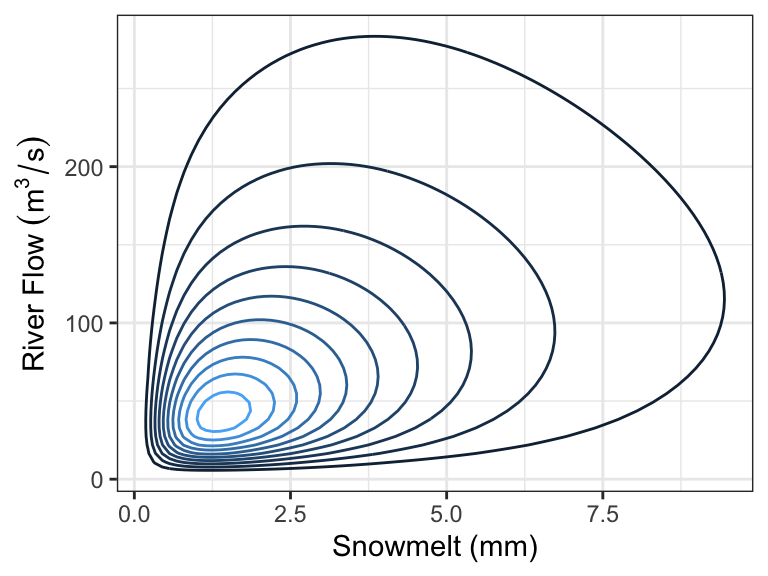

Every day, a measurement of snowmelt is obtained. To predict the river flow, usually the conditional mean of river flow given snowmelt is used as a prediction, but median is also used. Here are the two quantities as a function of snow melt:

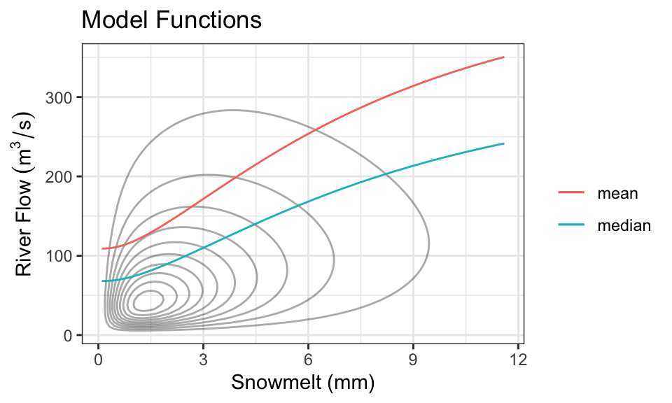

These functions are called __model functions__, and there are a ton of methods out there to help us directly estimate these model functions _without knowing the density_. This is the topic of supervised learning -- even advanced supervised learning methods like deep learning are just finding a model function like this (although, usually when there are more than one $X$ variable).


It's also quite common to produce prediction intervals. Here is an example of an 80% prediction interval, using the 0.1- and 0.9-quantiles as the lower and upper limits:

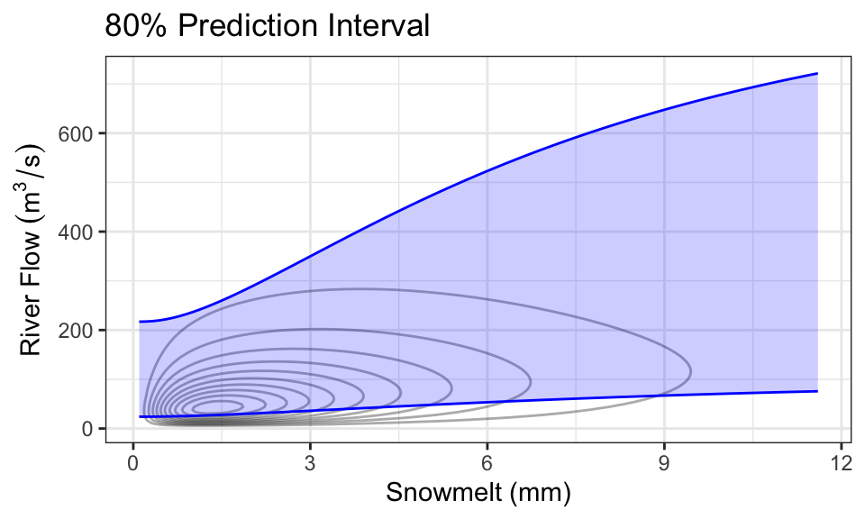


As a concrete example, consider the case where we know there's been 1mm of snowmelt. To obtain the conditional distribution of flow ($Y$) given this information, we just "slice" the joint density at $x =$ 1, and renormalize. Here is that density (which is now univariate!), compared with the marginal distribution of $Y$ (representing the case where we know nothing about snowmelt, $X$):

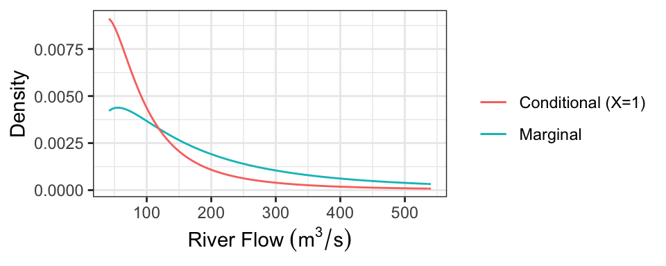

The following table presents some properties of these distributions:


|Quantity |Marginal        |Conditional     |
|:--------|:---------------|:---------------|
|Mean     |247.31          |118.16          |
|Median   |150             |74.03           |
|80% PI   |[41.64, 540.33] |[25.67, 236.33] |


Notice that we actually only need the conditional distribution of $Y$ given $X=x$ for each value of $x$ to produce these plots! In practice, we usually just specify these conditional distributions. So, having the joint density is actually "overkill".


### Direction of Dependence

Two variables can be dependent in a multitude of ways, but usually there's an overall direction of dependence:

- __Positively related__ random variables tend to increase together. That is, larger values of $X$ are associated with larger values of $Y$.
- __Negatively related__ random variables have an inverse relationship. That is, larger values of $X$ are associated with smaller values of $Y$.

We've already seen some measures of dependence in the discrete setting: covariance, correlation, and Kendall's tau. These definitions carry over. It's a little easier to visualize the definition of covariance as the signed sum of rectangular area:

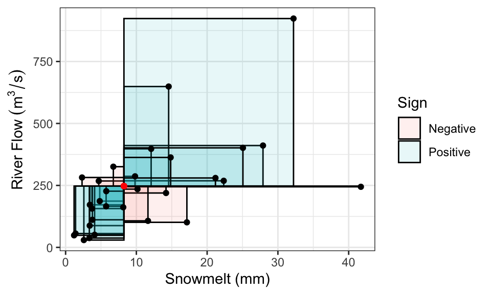

Correlation, remember, is also the signed sum of rectangles, but after converting $X$ and $Y$ to have variances of 1. 

Here are two positively correlated variables, because there is overall tendency of the contour lines to point up and to the right (or down and to the left):

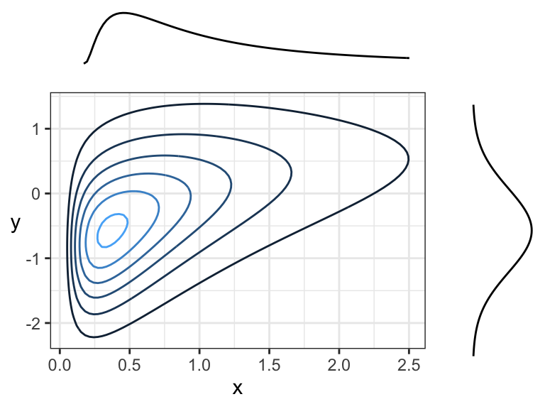


Here are two negatively correlated variables, because there is overall tendency for the contour lines to point down and to the right (or up and to the left):


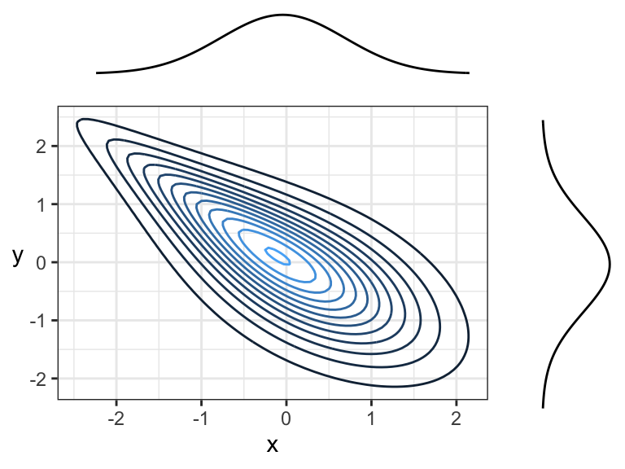


Another example of negative correlation. Although contour lines aren't pointing in any one direction, there's more density along a line that points down and to the right (or up and to the left) than there is any other direction.

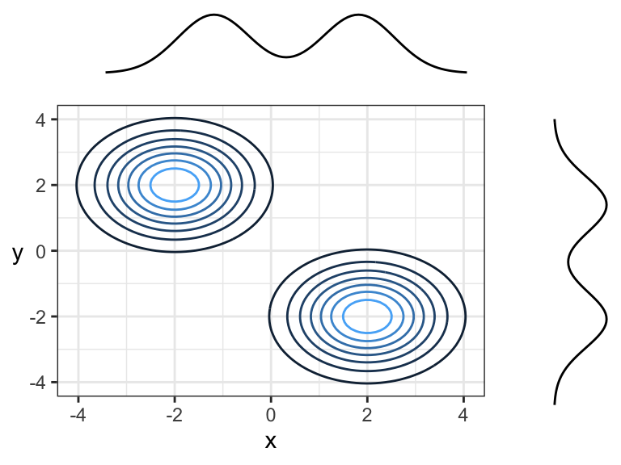

Here are two random variables that are dependent, yet have 0 correlation (both Pearson's and Kendall's) because the overall trend is flat (pointing left or right). You can think of this in terms of slicing: slicing at $x = -2$ would result in a highly peaked distribution near $y = 0$, whereas slicing at $x = 1$ would result in a distribution with a much wider spread -- these are not densities that are multiples of each other! Prediction intervals would get wider with larger $x$.

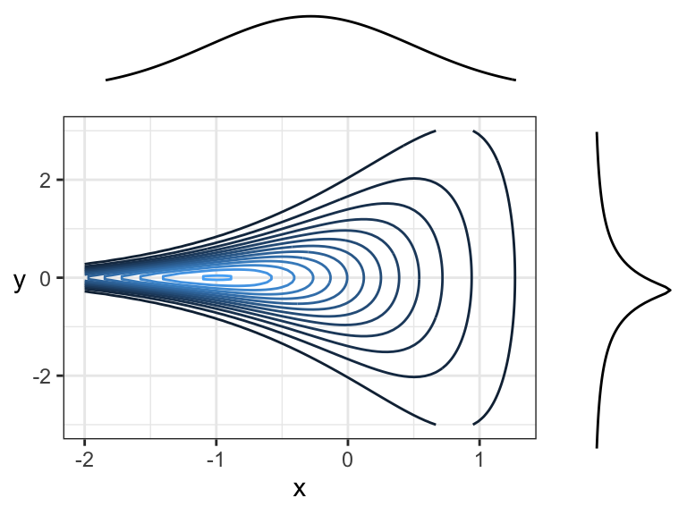

Note that the marginal distributions have _nothing to do with the dependence_ between random variables. Here are some examples of joint distributions that all have the same marginals ($N(0,1)$), but different dependence structures and strengths of dependence:

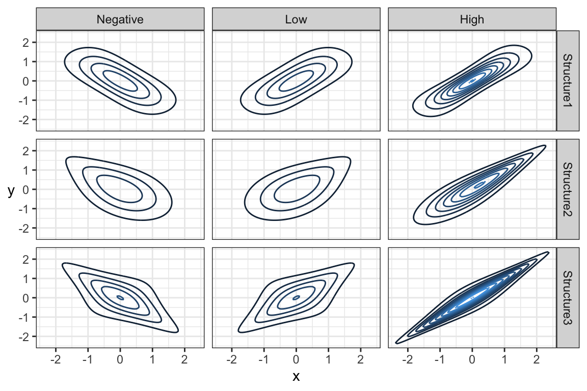

## Marginal Distributions

In the river flow example, we used snowmelt to inform river flow by communicating the conditional distribution of river flow given snowmelt. But, this requires knowledge of snowmelt! What if one day we are missing an observation on snowmelt? Then, the best we can do is communicate the marginal distribution of river flow. But how can we get at that distribution? Usually, aside from the data, we only have information about the conditional distributions. But this is enough to calculate the marginal distribution!

### Marginal Distribution from Conditional 

We can use the law of total probability to calculate a marginal density. Recall that for discrete random variables $X$ and $Y$, we have
$$P(Y = y) = \sum_x P(X = x, Y = y) = \sum_x P(Y = y \mid X = x) P(X = x).$$
The same thing applies in the continuous case, except probabilities become densities and sums become integrals (as usual in the continuous world): for continuous $X$ and $Y$,
$$f_Y(y) = \int_x f_{X,Y}(x,y)\ \text{d}x = \int_x f_{Y\mid X}(y \mid x)\ f_X(x)\ \text{d}x.$$

Notice that this is just an average of the conditional densities! If we have the conditional densities and a sample of $X$ values $x_1, \ldots, x_n$, then using the empirical approximation of the mean, we have
$$f_Y(y) \approx \frac{1}{n} \sum_{i = 1}^n f_{Y\mid X}(y \mid x_i).$$

A similar result holds for the cdf. We have
$$F_Y(y) = \int_x F_{Y \mid X}(y \mid x)\ f_X(x) \ \text{d}x,$$
and empirically,
$$F_Y(y) \approx \frac{1}{n}\sum_{i = 1}^n F_{Y\mid X}(y \mid x_i).$$

### Marginal Mean from Conditional

Perhaps more practical is finding the marginal mean, which we can obtain using the law of total expectation (similar to the discrete case we saw in a previous lecture):
$$E(Y) = \int_x m(x) \ f_{X}(x) \ \text{d}x = E(m(X)),$$
where $m(x) = E(Y \mid X = x)$ (i.e., the model function or regression curve).

When you fit a model using supervised learning, you usually end up with an estimate of $m(x)$. From the above, we can calculate the marginal mean as the mean of $m(X)$, which we can do empirically using a sample of $X$ values $x_1, \ldots, x_n$. Using the empirical mean, we have
$$E(Y) \approx \frac{1}{n} \sum_{i=1}^n m(x_i).$$

### Marginal Quantiles from Conditional

Unfortunately, if you have the $p$-quantile of $Y$ given $X = x$, then there's no convenient way of calculating the $p$-quantile of $Y$ as an average. To obtain this marginal quantity, you would need to calculate $F_Y(y)$ (as above), and then find the value of $y$ such that $F_Y(y) = p$. 

### Activity

You've observed the following data of snowmelt and river flow:


| Snowmelt (mm)| Flow (m^3/s)|
|-------------:|------------:|
|             1|          140|
|             3|          150|
|             3|          155|
|             2|          159|
|             3|          170|

From this, you've deciphered that the mean flow given snowmelt is
$$E(\text{Flow} \mid \text{Snowmelt} = x) = 100 + 20x.$$

You also decipher that the conditional standard deviation is constant, and is:
$$SD(\text{Flow} \mid \text{Snowmelt} = x) = 15\ m^3/s$$
It also looks like the conditional distribution of river flow given snowmelt follows a Lognormal distribution. 

Part 1: A new reading of snowmelt came in, and it's 4mm. 

1. Make a prediction of river flow.
2. What distribution describes your current understanding of what the river flow will be?

Part 2: Your snowmelt-recording device is broken, so you don't know how much snowmelt there's been.

3. Make a prediction of river flow. 
4. What distribution describes your current understanding of what the river flow will be?
5. Someone tells you that a 90% prediction interval is [70, 170]. What do we know about the median?

