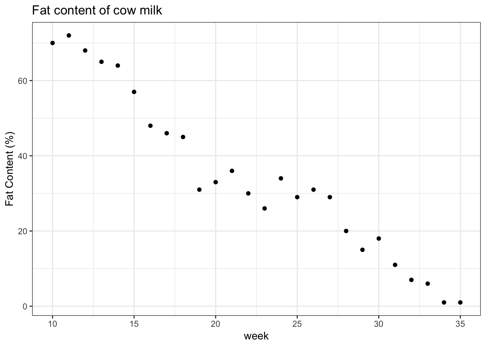
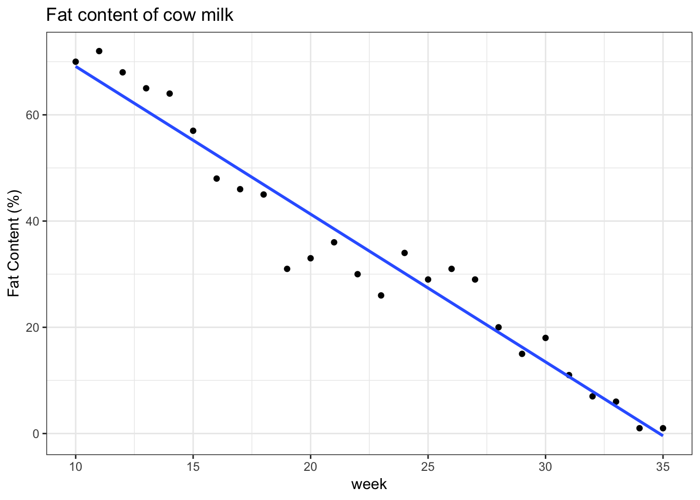
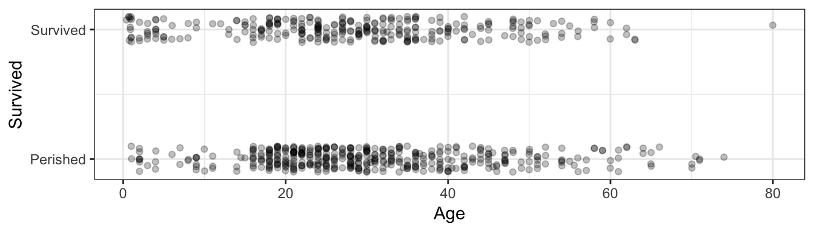
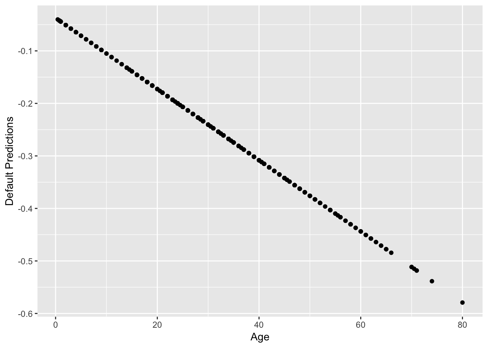
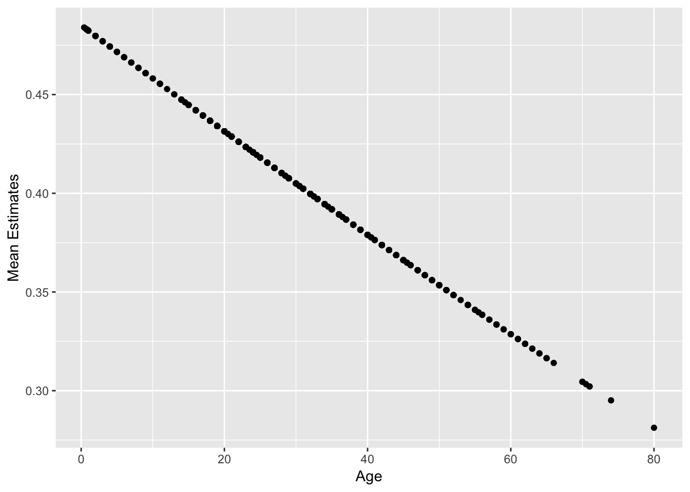
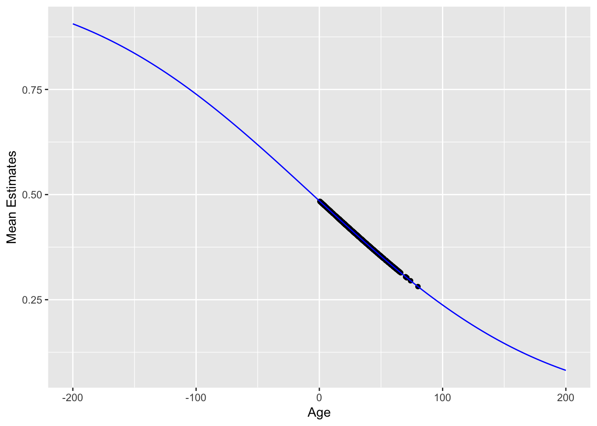

# Scales and the restricted range problem

**Caution: in a highly developmental stage! See Section  \@ref(caution).**


link functions and alternative parameter interpretations (categorical data too)

In Regression I, the response was allowed to take on any real number. But what if the range is restricted?


```r
suppressPackageStartupMessages(library(tidyverse))
```

```
## Warning: package 'ggplot2' was built under R version 3.5.2
```

```
## Warning: package 'tibble' was built under R version 3.5.2
```

```
## Warning: package 'purrr' was built under R version 3.5.2
```

```
## Warning: package 'dplyr' was built under R version 3.5.2
```

```
## Warning: package 'stringr' was built under R version 3.5.2
```

```r
Wage <- ISLR::Wage
NCI60 <- ISLR::NCI60
baseball <- Lahman::Teams %>% tbl_df %>% 
  select(runs=R, hits=H)
cow <- suppressMessages(read_csv("data/milk_fat.csv"))
esoph <- as_tibble(esoph) %>% 
    mutate(agegp = as.character(agegp))
titanic <- na.omit(titanic::titanic_train)
```

## Problems

Here are some common examples.

1. Positive values: river flow. 
    - Lower limit: 0
2. Percent/proportion data: proportion of income spent on housing in Vancouver. 
    - Lower limit: 0
    - Upper limit: 1. 
3. Binary data: success/failure data.
    - Only take values of 0 and 1.
4. Count data: number of male crabs nearby a nesting female
    - Only take count values (0, 1, 2, ...)

Here is an example of the fat content of a cow's milk, which was recorded over time. Data are from the paper ["Transform or Link?"](https://core.ac.uk/download/pdf/79036775.pdf). Let's consider data as of week 10:


```r
(plot_cow <- cow %>% 
    filter(week >= 10) %>% 
    ggplot(aes(week, fat*100)) +
    geom_point() +
    theme_bw() +
    labs(y = "Fat Content (%)") +
    ggtitle("Fat content of cow milk"))
```



Let's try fitting a linear regression model. 


```r
plot_cow +
    geom_smooth(method = "lm", se = FALSE)
```



Notice the problem here -- __the regression lines extend beyond the possible range of the response__. This is _mathematically incorrect_, since the expected value cannot extend outside of the range of Y. But what are the _practical_ consequences of this?

In practice, when fitting a linear regression model when the range of the response is restricted, we lose hope for extrapolation, as we obtain logical fallacies if we do. In this example, a cow is expected to produce _negative_ fat content after week 35!

Despite this, a linear regression model might still be useful in these settings. After all, the linear trend looks good for the range of the data. 


## Solutions

How can we fit a regression curve to stay within the bounds of the data, while still retaining the interpretability that we have with a linear model function? Remember, non-parametric methods like random forests or loess will not give us interpretation. Here are some options:

1. Transform the data. 
2. Transform the linear model function: link functions
3. Use a scientifically-backed parametric function.

### Solution 1: Transformations

One solution that _might_ be possible is to transform the response so that its range is no longer restricted. 
The most typical example is for positive data, like river flow. If we log-transform the response, then the new response can be any real number. All we have to do is fit a linear regression model to this transformed data.

One downfall is that we lose interpretability, since we are estimating the mean of $\log(Y)$ (or some other transformation) given the predictors, not $Y$ itself! Transforming the model function by exponentiating will not fix this problem, either, since the exponential of an expectation is not the expectation of an exponential. Though, this is a mathematical technicality, and might still be a decent approximation in practice.

Also, transforming the response might not be fruitful. For example, consider a binary response. No transformation can spread the two values to be non-binary!

### Solution 2: Link Functions

Instead of transforming the data, why not transform the model function? For example, instead of taking the logarithm of the response, perhaps fit the model $$ E(Y|X=x) = \exp(\beta_0 + \beta x) = \alpha \exp(\beta x) $$. Or, in general, $$ g(E(Y|X=x)) = X^T \beta $$ for some increasing function $g$ called the _link function_. 

This has the added advantage that we do not need to be able to transform the response.

Two common examples of link functions:

- $\log$, for positive response values.
    - Parameter interpretation: an increase of one unit in the predictor is associated with an $\exp(\beta)$ times increase in the mean response, where $\beta$ is the slope parameter.
- $\text{logit}(x)=\log(x/(1-x))$, for binary response values.
    - Parameter interpretation: an increase of one unit in the predictor is associated with an $\exp(\beta)$ times increase in the odds of "success", where $\beta$ is the slope parameter, and odds is the ratio of success to failure probabilities.

### Solution 3: Scientifically-backed functions

Sometimes there are theoretically derived formulas for the relationship between response and predictors, which have parameters that carry some meaning to them.

## GLM's in R

This document introduces the `glm()` function in R for fitting a Generlized Linear Model (GLM). We'll work with the `titanic_train` dataset in the `titanic` package.


```r
str(titanic)
```

```
## 'data.frame':	714 obs. of  12 variables:
##  $ PassengerId: int  1 2 3 4 5 7 8 9 10 11 ...
##  $ Survived   : int  0 1 1 1 0 0 0 1 1 1 ...
##  $ Pclass     : int  3 1 3 1 3 1 3 3 2 3 ...
##  $ Name       : chr  "Braund, Mr. Owen Harris" "Cumings, Mrs. John Bradley (Florence Briggs Thayer)" "Heikkinen, Miss. Laina" "Futrelle, Mrs. Jacques Heath (Lily May Peel)" ...
##  $ Sex        : chr  "male" "female" "female" "female" ...
##  $ Age        : num  22 38 26 35 35 54 2 27 14 4 ...
##  $ SibSp      : int  1 1 0 1 0 0 3 0 1 1 ...
##  $ Parch      : int  0 0 0 0 0 0 1 2 0 1 ...
##  $ Ticket     : chr  "A/5 21171" "PC 17599" "STON/O2. 3101282" "113803" ...
##  $ Fare       : num  7.25 71.28 7.92 53.1 8.05 ...
##  $ Cabin      : chr  "" "C85" "" "C123" ...
##  $ Embarked   : chr  "S" "C" "S" "S" ...
##  - attr(*, "na.action")= 'omit' Named int  6 18 20 27 29 30 32 33 37 43 ...
##   ..- attr(*, "names")= chr  "6" "18" "20" "27" ...
```


Consider the regression of `Survived` on `Age`. Let's take a look at the data with jitter:


```r
ggplot(titanic, aes(Age, Survived)) +
    geom_jitter(height=0.1, alpha=0.25) +
    scale_y_continuous(breaks=0:1, labels=c("Perished", "Survived")) +
    theme_bw()
```



Recall that the linear regression can be done with the `lm` function:


```r
res_lm <- lm(Survived ~ Age, data=titanic)
summary(res_lm)
```

```
## 
## Call:
## lm(formula = Survived ~ Age, data = titanic)
## 
## Residuals:
##     Min      1Q  Median      3Q     Max 
## -0.4811 -0.4158 -0.3662  0.5789  0.7252 
## 
## Coefficients:
##              Estimate Std. Error t value Pr(>|t|)    
## (Intercept)  0.483753   0.041788  11.576   <2e-16 ***
## Age         -0.002613   0.001264  -2.067   0.0391 *  
## ---
## Signif. codes:  0 '***' 0.001 '**' 0.01 '*' 0.05 '.' 0.1 ' ' 1
## 
## Residual standard error: 0.4903 on 712 degrees of freedom
## Multiple R-squared:  0.005963,	Adjusted R-squared:  0.004567 
## F-statistic: 4.271 on 1 and 712 DF,  p-value: 0.03912
```

In this case, the regression line is ``0.4837526`` + ``-0.0026125`` `Age`.

A GLM can be fit in a similar way, using the `glm` function -- we just need to indicate what type of regression we're doing (binomial? poission?) and the link function. We are doing bernoulli (binomial) regression, since the response is binary (0 or 1); lets choose a `probit` link function.


```r
res_glm <- glm(factor(Survived) ~ Age, data=titanic, family=binomial(link="probit"))
```

The `family` argument takes a __function__, indicating the type of regression. See `?family` for the various types of regression allowed by `glm()`. 

Let's see a summary of the GLM regression:


```r
summary(res_glm)
```

```
## 
## Call:
## glm(formula = factor(Survived) ~ Age, family = binomial(link = "probit"), 
##     data = titanic)
## 
## Deviance Residuals: 
##     Min       1Q   Median       3Q      Max  
## -1.1477  -1.0363  -0.9549   1.3158   1.5929  
## 
## Coefficients:
##              Estimate Std. Error z value Pr(>|z|)  
## (Intercept) -0.037333   0.107944  -0.346   0.7295  
## Age         -0.006773   0.003294  -2.056   0.0397 *
## ---
## Signif. codes:  0 '***' 0.001 '**' 0.01 '*' 0.05 '.' 0.1 ' ' 1
## 
## (Dispersion parameter for binomial family taken to be 1)
## 
##     Null deviance: 964.52  on 713  degrees of freedom
## Residual deviance: 960.25  on 712  degrees of freedom
## AIC: 964.25
## 
## Number of Fisher Scoring iterations: 4
```

We can make predictions too, but this is not as straight-forward as in `lm()` -- here are the "predictions" using the `predict()` generic function:


```r
pred <- predict(res_glm)
qplot(titanic$Age, pred) + labs(x="Age", y="Default Predictions")
```



Why the negative predictions? It turns out this is just the linear predictor, ``-0.0373331`` + ``-0.0067733`` `Age`.

The documentation for the `predict()` generic function on `glm` objects can be found by typing `?predict.glm`. Notice that the `predict()` generic function allows you to specify the *type* of predictions to be made. To make predictions on the mean (probability of `Survived=1`), indicate `type="response"`, which is the equivalent of applying the inverse link function to the linear predictor.

Here are those predictions again, this time indicating `type="response"`:


```r
pred <- predict(res_glm, type="response")
qplot(titanic$Age, pred) + labs(x="Age", y="Mean Estimates")
```



Look closely -- these predictions don't actually fall on a straight line. They follow an inverse probit function (i.e., a Gaussian cdf):


```r
mu <- function(x) pnorm(res_glm$coefficients[1] + res_glm$coefficients[2] * x)
qplot(titanic$Age, pred) + 
    labs(x="Age", y="Mean Estimates") +
    stat_function(fun=mu, colour="blue") +
    scale_x_continuous(limits=c(-200, 200))
```



### `broom::augment()`

We can use the `broom` package on `glm` objects, too. But, just like we had to specify `type="response"` when using the `predict()` function in order to evaluate the model function, so to do we have to specify something in the `broom::augment()` function. Here, the `type.predict` argument gets passed to the `predict()` generic function (actually, the `predict.glm()` method). This means that indicating `type.predict="response"` will evaluate the model function:


```r
res_glm %>% 
  broom::augment(type.predict = "response") %>% 
  head()
```

```
## # A tibble: 6 x 10
##   .rownames factor.Survived.   Age .fitted .se.fit .resid    .hat .sigma
##   <chr>     <fct>            <dbl>   <dbl>   <dbl>  <dbl>   <dbl>  <dbl>
## 1 1         0                   22   0.426  0.0209 -1.05  0.00179   1.16
## 2 2         1                   38   0.384  0.0211  1.38  0.00188   1.16
## 3 3         1                   26   0.415  0.0190  1.33  0.00149   1.16
## 4 4         1                   35   0.392  0.0196  1.37  0.00160   1.16
## 5 5         0                   35   0.392  0.0196 -0.997 0.00160   1.16
## 6 7         0                   54   0.343  0.0345 -0.917 0.00528   1.16
## # … with 2 more variables: .cooksd <dbl>, .std.resid <dbl>
```


## Options for Logistic Regression


Some popular
interpretable quantities (IQ's) which compare exposure risk $\pi_{E}$ to
baseline (unexposed) risk $\pi_{B}$ are

1.  the *risk difference*, $\pi_{E}-\pi_{B}$,

2.  the reciprocal risk difference, or *number needed to treat* (NNT)
    (or sometimes *number needed to harm*),

3.  the *relative risk*, $\pi_{E}/\pi_{B}$, and

4.  the *odds ratio*,

These IQ's consider all other factors to be equal.


### Models

A first inclination may be to model the mean as one would in the case of
multiple linear regression that is, as a linear combination of the
covariates. The link function $g$ is the identity, and the model becomes (EQUATION).
Kovalchik and others (2013) refer to this as the "Binomial Linear
Model", or BLM, though it is more commonly known as the "Linear
Probability Model", or LPM (see, for example, Aldrich and Nelson, 1984;
Amemiya, 1977; Horrace and Oaxaca, 2006). In this paper, the model is
referred to as the LPM.

Before proceeding with any further discussion, the validity of this
model must be enforced. The Bernoulli distribution requires
$0\leq\pi(X)\leq1$ for all $x$
$\boldsymbol{x}\in XX$ to be a valid distribution. Validity
can be ensured by restricting the parameter space of
$\left(\beta_{0},\boldsymbol{\beta}\right)$ to .
However, the parameter space can be severely restricted depending on the
covariate space. For example, if predictor $k$ of
is unbounded, then the only allowable value for
$\beta_{k}$ is zero. In other words, any covariate in the LPM that has
an unbounded range cannot technically be included in the LPM. Further,
even if component $k$ is bounded, if it has a large
range, then the slope is restricted to be small.

One reason why the LPM is used, despite the above restrictions, is for
access to *constant interpretable quantities* that is, IQ's discussed in
section 1 which do not depend on other covariates. In an LPM, the risk
difference by increasing $X_{k}$ by one unit is simply given by
$\beta_{k}$, and the NNT is $1/\beta_{k}$. However, the relative risk
and odds ratio are non-constant, as they are functions of the other
covariates.

Since the LPM is just a multiple linear regression model, the regression
parameters can be estimated without bias by ordinary least squares
(OLS). However, we do not necessarily have homoskedastic errors, since $Var(Y|X=x)$
differs with the covariates. As such, the efficiency of the OLS
estimator can be improved by the weighted least squares estimator with
weights $1/\sigma\left(\boldsymbol{x}\right)$. Since these weights are
unknown, an iterative algorithm is used, which calculates weights using
the fitted probabilities
from parameter estimates of the previous step to compute a new
"re-weighted" estimator. Iterating this beginning with the OLS estimator
converges to the *iteratively re-weighted least squares* (IRLS)
estimator. Amemiya (1977) shows that the IRLS is identical to the
maximum likelihood estimator (MLE).

An alternative model which is sometimes confused for the LPM (for
example, see Horrace and Oaxaca, 2006) is to allow for an arbitrary
parameter space by taking
$\pi(x)$ to be zero when $\eta$ is less than
zero, and unity otherwise. This model, which I call the "truncated LPM"
(TLPM), is (EQUATION)
where the inverse-link function $T$ is the ramp function (actually, $T$ is not
quite an inverse-link function because it is non-invertible, but this is
unimportant). However, as one can see by the differing link function,
this is not the LPM, although it is often mistaken for the LPM. Horrace
and Oaxaca (2006) mistake the TLPM for the LPM, and in doing so, show
that estimation of the model parameters through OLS or IRLS provide
biased and inconsistent estimators. This is a good reason why the TLPM
should not be used unless a different method of estimation is
considered.

To rid the parameter space of restrictions, one may
consider link functions similar to the ramp function (preferably smooth) to ensure
$0\leq\pi(x)\leq1$. Popular choices are logit, probit, the inverse Gumbel distribution function, or the angular function (Cox and Snell, 1989). Each of these
link functions ensures a valid probability for an arbitrary parameter
space. The logit
link function is a popular choice because it has the best
interpretability. It models the log-odds as a linear function of the
covariates that is, (EQUATION).
This model is known as the logistic regression model, and can be written
equivalently as ,
where 
is the inverse logit function. The logistic model
stands out over models with other link functions because a constant IQ
can be obtained from it the odds ratio by increasing $X_{k}$ by one unit
is simply $\exp\left(\beta_{k}\right)$. However, of the interpretable
quantities discussed in Section 1, the odds ratio is the most difficult
to interpret. Though, if both risks are smallthe "rare disease
assumption" with risks under $0.1$ then the odds ratio is a good
approximation to the relative risk, which is easier to interpret. The
lack of an easy interpretable constant IQ is why some researchers will
opt for the LPM instead of the logistic model when the rare disease
assumption is invalid. Indeed, this is one major reason behind the study
done by Kovalchik and others (2013). One other method to decide is
through Goodness of Fit criteria, which was the other deciding factor of
Kovalchik and others.

Conveniently, the log odds appears in the likelihood of the logistic
model, which simplifies some computations. This leads to the MLE which
solves the equation .
However, occasionally it is possible that no MLE exists when there is a
$\left(b_{0},\boldsymbol{b}\right)\in\mathcal{F}$ such that
$b_{0}+\boldsymbol{x}_{i}^{T}\boldsymbol{b}>0$ has $Y_{i}=1$ and
$b_{0}+\boldsymbol{x}_{i}^{T}\boldsymbol{b}<0$ has $Y_{i}=0$ for each
$i=1,\ldots,n$ (Albert and Anderson, 1984). This is called the case of
"complete separation", and the likelihood has no maximum, so a "perfect
fit" is made by infinitely pushing the covariate data to the tails of
the expit curve. This is not an issue with the LPM
model.

