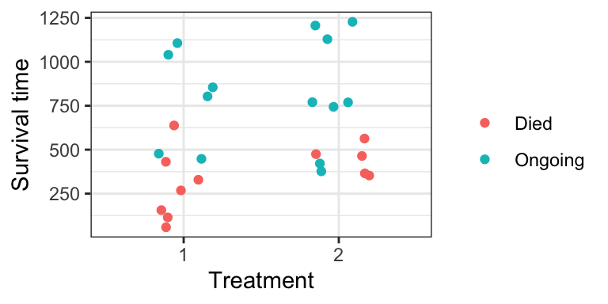
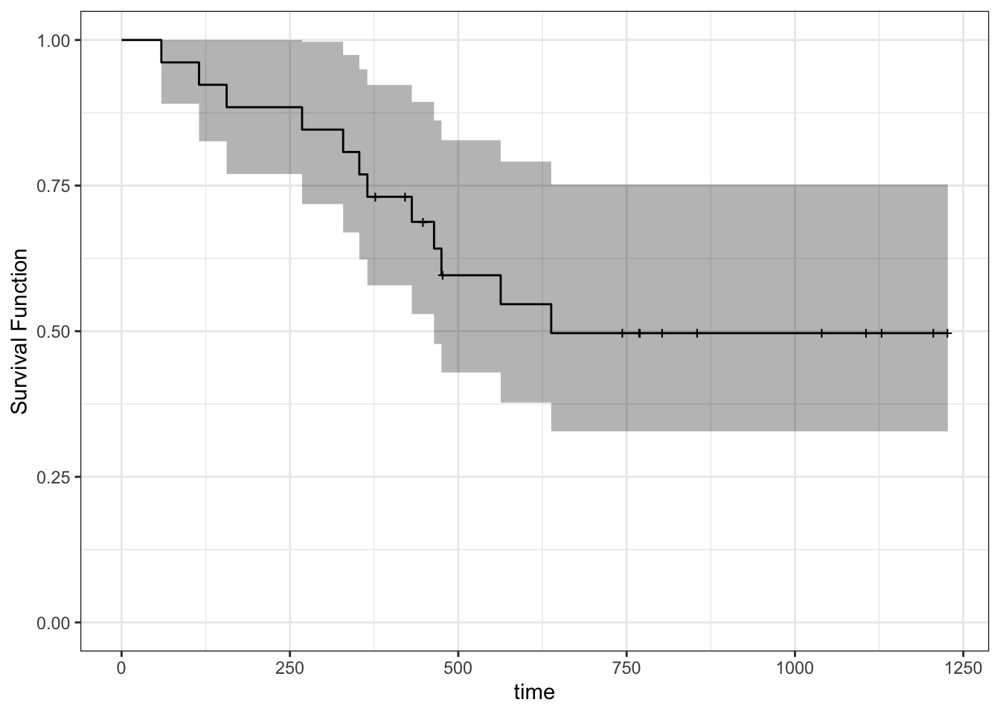
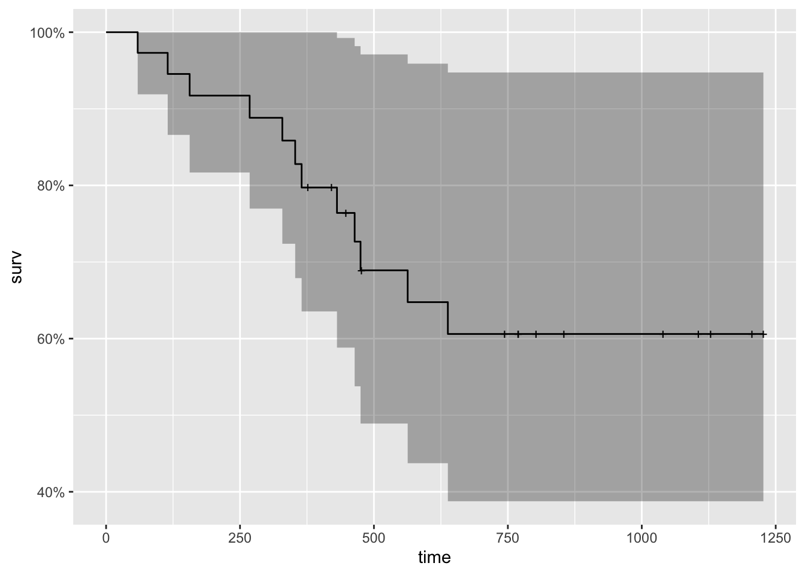

# Special cases {-}


# Regression when data are censored: survival analysis


```r
suppressPackageStartupMessages(library(tidyverse))
suppressPackageStartupMessages(library(survival))
suppressPackageStartupMessages(library(ggfortify))
suppressPackageStartupMessages(library(broom))
```

In this case study, we will use the `ovarian` data from the `survival` R package to investigate survival times (`futime`) for ovarian cancer patients. Specifically, we will focus on both regression tasks:

- prediction, given treatment (`rx`)
- interpreting/inferring the effect of treatment (`rx`)

To get started, ensure you have the requisite R packages installed. You probably already have `broom` and `tidyverse` installed, but not these:

```
install.packages("survival")
install.packages("ggfortify")
```

## Data

Here is a snippet of the relevant data. Notice a defining feature of this dataset: not all survival times are complete!

__Censored observation__: a number for which we know the actual outcome is larger. An "incomplete" observation. Also called __survival data__.

(Naturally, we can extend the notion of censoring to "smaller", and to other notions, but we won't consider this here)


```r
ovarian <- survival::ovarian %>% 
    as_tibble() %>% 
    select(futime, fustat, rx) %>% 
    mutate(rx = factor(rx),
           fustat = fustat)
head(ovarian)
```

```
## # A tibble: 6 × 3
##   futime fustat rx   
##    <dbl>  <dbl> <fct>
## 1     59      1 1    
## 2    115      1 1    
## 3    156      1 1    
## 4    421      0 2    
## 5    431      1 1    
## 6    448      0 1
```

With R, we can indicate a response is censored using the `survival::Surv()` function. This forms the foundation to survival analysis in R. 

`Surv()` takes the survival times and the censoring indicator


```r
Surv(ovarian$futime, 
     event = (ovarian$fustat))
```

```
##  [1]   59   115   156   421+  431   448+  464   475   477+  563   638   744+
## [13]  769+  770+  803+  855+ 1040+ 1106+ 1129+ 1206+ 1227+  268   329   353 
## [25]  365   377+
```

Here is a plot of the data:


```r
ovarian %>% 
    mutate(censor = if_else(fustat == 1, "Died", "Ongoing")) %>% 
    ggplot(aes(rx, futime)) +
    geom_jitter(aes(colour = censor), width = 0.2) +
    theme_bw() +
    labs(x = "Treatment",
         y = "Survival time") +
    scale_colour_discrete("")
```



Other data examples:

1. __Churn__. You want to keep subscribers to your YouTube channel. Google has given you the subscription date and drop-out date (if applicable) for all subscribers you've ever had.
2. __Light Bulbs__. You've designed a new light bulb, and wish to tell buyers how long they will last. 

## Univariate Estimation

No matter whether we're interested in prediction or interpretation, we first need to be able to estimate things from univariate data.

But how can we even estimate something as simple as the mean? What are the consequences for the following two approaches?

1. Ignore the censoring:


```r
mean(ovarian$futime)
```

```
## [1] 599.5385
```

2. Remove censored data:


```r
ovarian %>% 
    filter(fustat == 0) %>%
    .[["futime"]] %>% 
    mean()
```

```
## [1] 812.2857
```


### Non-parametric Estimates with Kaplan-Meier 

**Survival Function**

_Question_: In what ways can we define a distribution?

Obtain the Kaplan-Meier estimate of the survival function using `survival::survfit()`. It's expecting a formula, but we're still working with the null model.


```r
(fit_km <- survfit(
    Surv(futime, fustat) ~ 1, 
    data = ovarian
))
```

```
## Call: survfit(formula = Surv(futime, fustat) ~ 1, data = ovarian)
## 
##       n  events  median 0.95LCL 0.95UCL 
##      26      12     638     464      NA
```

To obtain the survival function, we have two options.

1. Obtain the heights of each "step" of the survival function, and their corresponding time-values (y). Use `summary()`, or better, `broom::tidy()`:


```r
tidy(fit_km)
```

```
## # A tibble: 26 × 8
##     time n.risk n.event n.censor estimate std.error conf.high conf.low
##    <dbl>  <dbl>   <dbl>    <dbl>    <dbl>     <dbl>     <dbl>    <dbl>
##  1    59     26       1        0    0.962    0.0392     1        0.890
##  2   115     25       1        0    0.923    0.0566     1        0.826
##  3   156     24       1        0    0.885    0.0708     1        0.770
##  4   268     23       1        0    0.846    0.0836     0.997    0.718
##  5   329     22       1        0    0.808    0.0957     0.974    0.670
##  6   353     21       1        0    0.769    0.107      0.949    0.623
##  7   365     20       1        0    0.731    0.119      0.923    0.579
##  8   377     19       0        1    0.731    0.119      0.923    0.579
##  9   421     18       0        1    0.731    0.119      0.923    0.579
## 10   431     17       1        0    0.688    0.134      0.894    0.529
## # … with 16 more rows
```

2. Just want the plot? `ggfortify::autoplot()` to the rescue! You can even add other layers to the resulting `ggplot2` object. Notice the "notches" wherever there's a censored observation. 


```r
autoplot(fit_km) +
    theme_bw() +
    ylab("Survival Function") +
    ylim(0, 1)
```

```
## Scale for 'y' is already present. Adding another scale for 'y', which will
## replace the existing scale.
```



**Quantiles**

You can find the median on the printout of `survfit` above. But in general, we can use the `survival::quantile()` S3 generic function.


```r
quantile(fit_km, 
         probs = c(0.25, 0.5), 
         conf.int = FALSE)
```

```
##  25  50 
## 365 638
```

What quantiles do not exist?

**Mean**

Does the mean exist?

Obtain the restricted mean using `print.survfit()`, or better, `broom::glance()`. Where is the restriction?


```r
glance(fit_km)
```

```
## # A tibble: 1 × 10
##   records n.max n.start events rmean rmean.std.error median conf.low conf.high
##     <dbl> <dbl>   <dbl>  <dbl> <dbl>           <dbl>  <dbl>    <dbl>     <dbl>
## 1      26    26      26     12  794.            91.5    638      464        NA
## # … with 1 more variable: nobs <int>
```

### Parametric Estimation

The Weibull family of distributions is a flexible and popular distributional assumption to make. Fit using `survival::survreg()`, just like `survival::survfit()`, but with `dist="weibull"`.


```r
(fit_wei <- survreg(
    Surv(futime, fustat) ~ 1, 
    data = ovarian,
    dist = "weibull"
))
```

```
## Call:
## survreg(formula = Surv(futime, fustat) ~ 1, data = ovarian, dist = "weibull")
## 
## Coefficients:
## (Intercept) 
##    7.111038 
## 
## Scale= 0.9024784 
## 
## Loglik(model)= -98   Loglik(intercept only)= -98
## n= 26
```

Get at the model parameters using `summary()`, or better, using `broom::tidy()`:


```r
tidy(fit_wei)
```

```
## # A tibble: 2 × 5
##   term        estimate std.error statistic   p.value
##   <chr>          <dbl>     <dbl>     <dbl>     <dbl>
## 1 (Intercept)    7.11      0.293    24.3   2.36e-130
## 2 Log(scale)    -0.103     0.254    -0.405 6.86e-  1
```

Lab assignment: calculate Weibull parameters using these estimates; then calculate estimates of probabilistic quantities. Hint: see the bottom of the `?survreg` documentation.

## Regression with Survival Data

The tricky part here? When there's a parametric assumption on the "model function" -- or perhaps it's more accurate here to say across the predictor space.

**Question**: How can we set up a regression model with a linear predictor? Feel free to use a link function to solve the restricted range problem. 


### Proportional Hazards Model

We can add "hazard function" to our list of things that can define a distribution. Why is this useful to model?

Fit a proportional hazards model with `survival::coxph()`. Our predictor is treatment (`rx`).


```r
(fit_ph <- coxph(
    Surv(futime, fustat) ~ rx, 
    data = ovarian
))
```

```
## Call:
## coxph(formula = Surv(futime, fustat) ~ rx, data = ovarian)
## 
##        coef exp(coef) se(coef)      z    p
## rx2 -0.5964    0.5508   0.5870 -1.016 0.31
## 
## Likelihood ratio test=1.05  on 1 df, p=0.3052
## n= 26, number of events= 12
```

_Question_: Linear regression over two categories is the same as estimating the mean for both categories. Is the Proportional Hazards regression model also estimating the hazard function separately for each category? 

We can already see Treatment 2 is not significant (under a 0.05 level). If it was significant, we'd interpet the hazard function under Treatment 2 to be exp(-0.5964) = 0.55 as much as the hazard function under Treatment 1.

### Prediction

__Your turn__:

Under the Proportional Hazards model, plot the survival function and obtain a mean estimate for Treatment 1 by filling in the following steps.

1. Convert the fitted model to a `survfit` object (which you can think of as a specific distribution). 
    - Be sure to specify the `newdata` argument like you would when using `predict()`.


```r
(fit_ph_survfit <- survfit(
    fit_ph, 
    newdata = data.frame(rx = 1)#ovarian[1, ]
))
```

```
## Warning in model.frame.default(data = structure(list(rx = 1), class =
## "data.frame", row.names = c(NA, : variable 'rx' is not a factor
```

```
## Call: survfit(formula = fit_ph, newdata = data.frame(rx = 1))
## 
##       n  events  median 0.95LCL 0.95UCL 
##      26      12      NA     475      NA
```

2. Plot the survival function that's stored in this new variable.
    - Hint: there's a handy function for that.
    

```r
fit_ph_survfit %>% 
    autoplot()
```



3. Obtain a mean estimate using a function from the `broom` package.


```r
fit_ph_survfit %>% 
    glance()
```

```
## # A tibble: 1 × 10
##   records n.max n.start events rmean rmean.std.error median conf.low conf.high
##     <dbl> <dbl>   <dbl>  <dbl> <dbl>           <dbl>  <dbl>    <dbl>     <dbl>
## 1      26    26      26     12  892.            108.     NA      475        NA
## # … with 1 more variable: nobs <int>
```

4. Obtain a median estimate using the `quantile` function.


```r
fit_ph_survfit %>% 
    quantile(probs = 0.5)
```

```
## $quantile
## 50 
## NA 
## 
## $lower
##  50 
## 475 
## 
## $upper
## 50 
## NA
```


## Concept list

- A measurement is _censored_ if we only know that its true value lies above some point.
    - For ease of discussion, we call the random variable of interest "time until event".
    - There are other types of censoring, but they are a simple extension of this definition.
- Removing censored data will result in uncertainty in our estimates to be larger than it could be, if we were to include the censored data.
    - Removing censored data could also result in _biased_ estimates, if data have only been collected for a short duration.
- Ignoring the censorship status (i.e., taking a censored observations to be the actual observations) will likely result in a biased (overly small) estimate.
- There are many ways a distribution can be depicted. Aside from the density/pmf and cdf, there's also:
    - The _survival function_ (= 1 - cdf) at `t` evaluates to the probability that the outcome exceeds `t`.
    - The _hazard function_ (= density / survival function) at `t` can be interpreted as the instantaneous "chance" of the event occuring, given that the event has not occured up until time `t`.
- Options for estimating quantities by incorporating the partial information contained in censored observations:
    - Survival function: if no distributional assumption is made, the Kaplan-Meier method can be used to estimate the survival function.
    - Mean: can be estimated as the area under an estimate of the survival function.
    - Quantiles: can be estimated by inverting an estimate of the survival function.
    - If a distributional assumption is made, the partial likelihood can be used to fit the distribution, and any quantity can be extracted from that distribution (not necessarily through the survival function).
- The Kaplan-Meier estimate of the survival function does not always drop to zero (when the largest observation is censored), in which case estimates of some high quantiles and the mean would not exist. A common "fix" is to force the survival function to drop to zero at the largest observation.
    - The mean estimate that results is called the _restricted_ mean.
- The Cox proportional hazards model is a commonly used model that allows us to interpret how predictors influence a censored response. It models an individual's hazard function as some baseline hazard, multiplied by `exp(eta)`, where `eta` is a linear combination of predictors.
    - The coefficient `beta` on a predictor `X` (contained in `eta`) has the following interpretation: an increase in `X` by one unit is associated with an increase in hazard (at any time) by `exp(beta)` times (i.e., the effect is multiplicative).
    - This assumes that any two hazard functions on the predictor space are the same, up to some multiplicative constant.
    - The hazard is useful to model due to its flexibility and interpretability.
- We can obtain a prediction at `X=x` from a proportional hazards model by converting the estimated hazard function evaluated at `x` to a survival function, and obtaining a univariate estimate as described above. 
