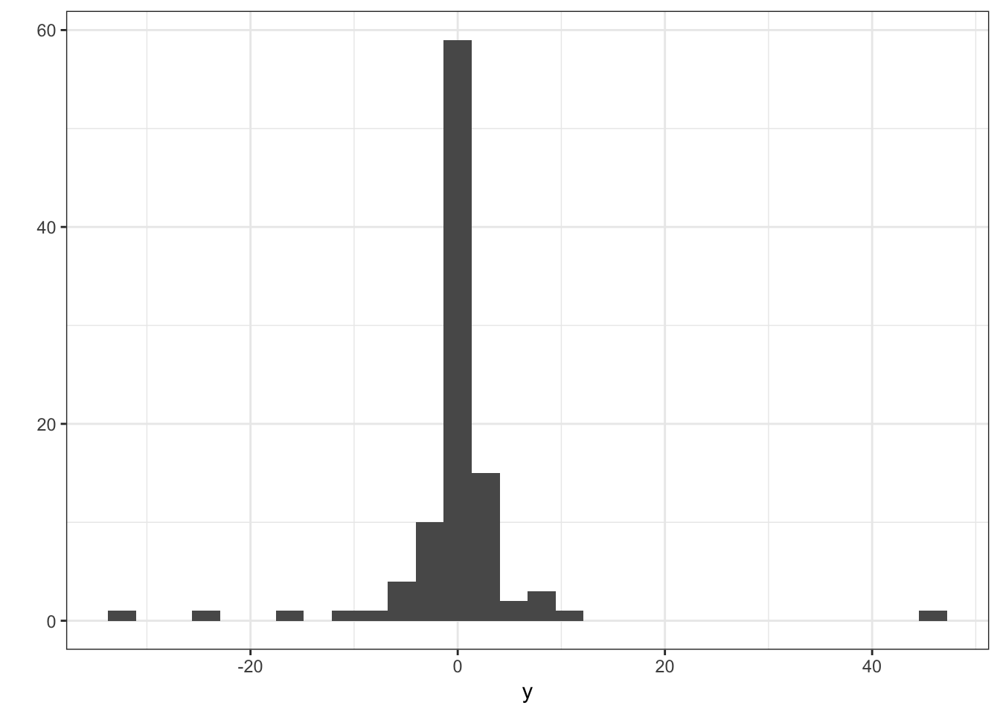
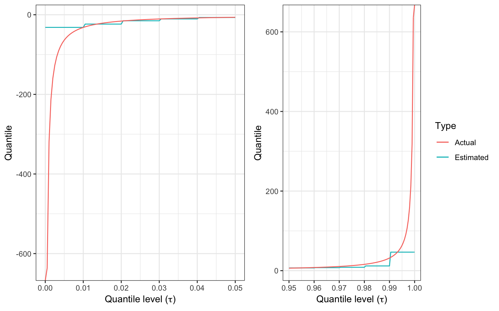

# Regression in the presence of extremes: extreme value regression

**Caution: in a highly developmental stage! See Section  \@ref(caution).**


```r
suppressPackageStartupMessages(library(tidyverse))
```

```
## Warning: package 'ggplot2' was built under R version 3.5.2
```

```
## Warning: package 'tibble' was built under R version 3.5.2
```

```
## Warning: package 'purrr' was built under R version 3.5.2
```

```
## Warning: package 'dplyr' was built under R version 3.5.2
```

```
## Warning: package 'stringr' was built under R version 3.5.2
```

The problem with estimating extreme quantiles in the "usual" sense: 

Here is a histogram of 100 observations generated from a Student's _t_(1) distribution (it's heavy-tailed):


```r
set.seed(4)
y <- rt(100, df=1)
qplot(y) + theme_bw()
```

```
## `stat_bin()` using `bins = 30`. Pick better value with `binwidth`.
```



Here are estimates of high and low quantiles, compared to the actual. You can see the discrepency grows quickly. __Extreme-low quantiles are too high__, whereas __extreme-high quantiles are too low__. 





As a rule of thumb, it's best to stay below $\tau=0.95$ or above $\tau=0.05$. If you really want estimates of these extreme quantiles, you'll need to turn to __Extreme Value Theory__ to make an assumption on the tail of the distribution of the data. One common approach is to fit a generalized Pareto distribution to the upper portion of the data, after which you can extract high quantiles. 
