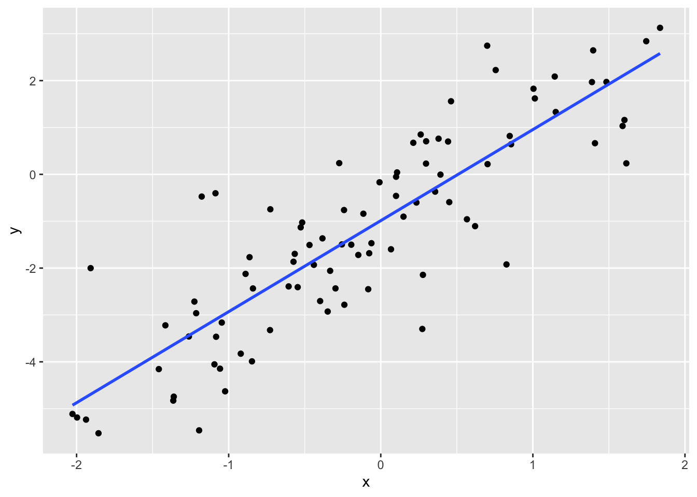
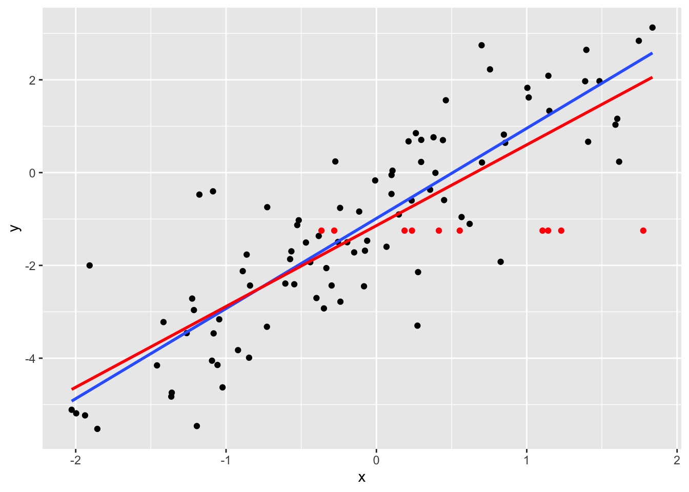
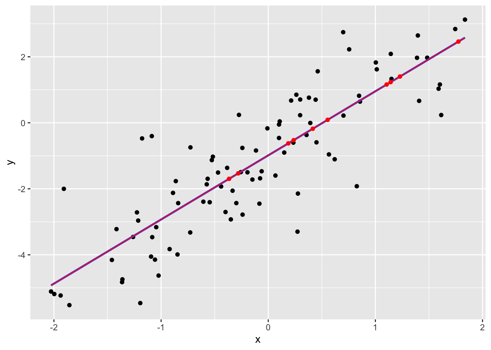
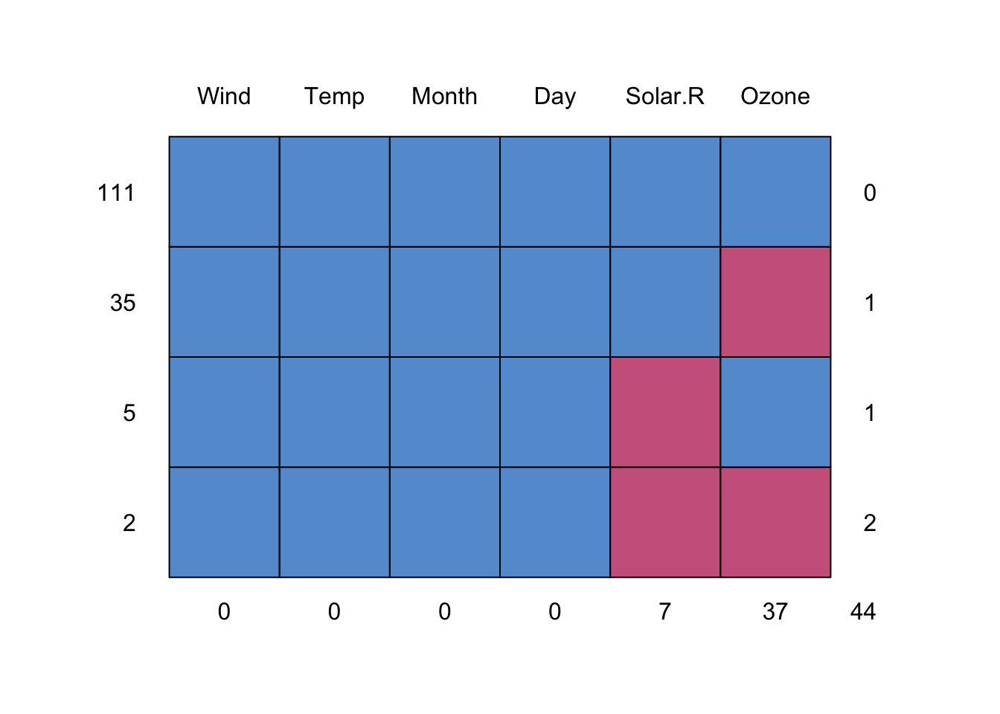
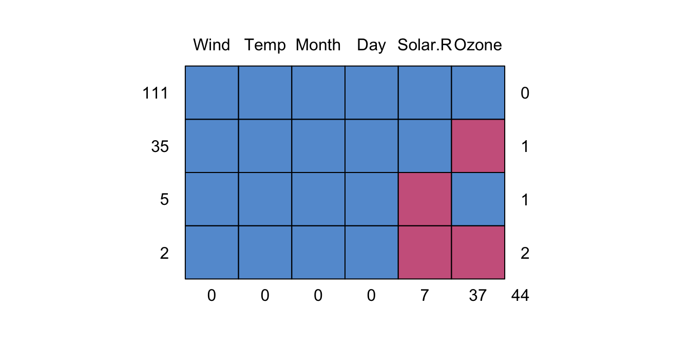
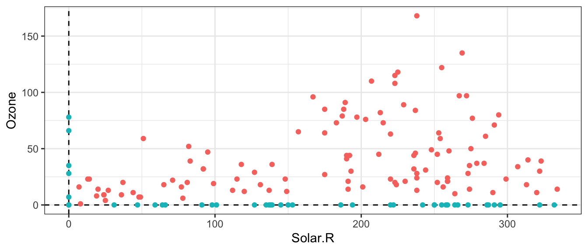
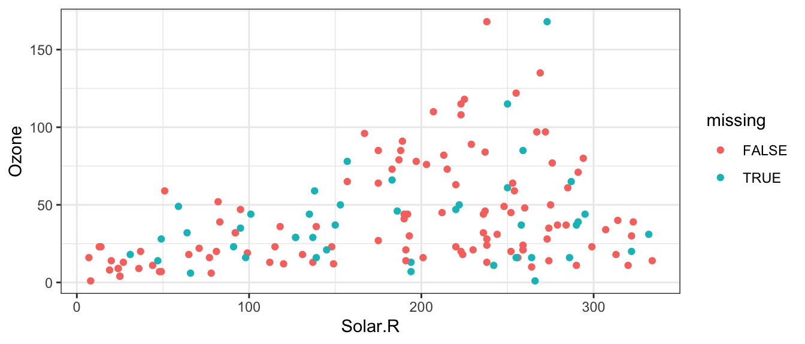

# Regression when data are missing: multiple imputation

**Caution: in a highly developmental stage! See Section  \@ref(caution).**

(DSCI 562 Tutorial)


```r
suppressPackageStartupMessages(library(tidyverse))
suppressPackageStartupMessages(library(mice))
```


Let's take a closer look at mean imputation vs. multiple imputation.

## Mean Imputation

Let's consider a simple linear regression example, with one explanatory variable. We'll generate 100 data points, and make 10 of the response values missing. 


```r
set.seed(13)
x <- rnorm(100)
y <- -1 + 2 * x + rnorm(100)
y[1:10] <- NA
```

Here are the data:


```r
x
```

```
##   [1]  0.55432694 -0.28027194  1.77516337  0.18732012  1.14252615  0.41552613
##   [7]  1.22950656  0.23667967 -0.36538277  1.10514427 -1.09359397  0.46187091
##  [13] -1.36098453 -1.85602715 -0.43985541 -0.19394690  1.39643151  0.10066325
##  [19] -0.11443881  0.70222523  0.26254267  1.83616330  0.35740242 -1.04541013
##  [25]  0.62018413  0.14935453 -1.45931685 -2.02704380 -1.05695776 -0.72814372
##  [31] -0.00821067  0.84779738 -0.38349150 -0.52651151 -0.27322596 -0.60574161
##  [37] -0.33286731 -0.24153755 -0.86277540 -0.84697075  0.10034035  1.59003353
##  [43]  0.56649488  1.61447949 -0.46865016 -0.72610140 -1.02333900 -1.93781553
##  [49]  0.27714729  1.40835367  0.27312919  0.75552507 -0.34901841 -0.54619076
##  [55]  0.23436199 -0.29782822 -0.84047613  0.82651036  1.48369123  0.69967564
##  [61] -1.26157415  0.29827174 -0.14780711 -0.88892233  1.01306586 -0.92052508
##  [67] -0.57389450  1.15036548  1.14382456 -0.23944276 -1.08680215 -0.06144699
##  [73] -0.51669734 -1.90767369  0.10715648 -1.17737519  1.74542691 -0.39869853
##  [79]  0.44243942  0.45027946 -0.07606216  0.29751322 -1.19435471 -1.99687548
##  [85]  1.38851305 -0.08248357  0.39251449 -1.08276971  1.60212039  1.00406897
##  [91]  0.37989570 -0.56550536 -1.21377810 -1.36430159 -1.41613295 -0.25557803
##  [97] -1.22542595  0.21383426  0.06722356  0.85663511
```

```r
y
```

```
##   [1]           NA           NA           NA           NA           NA
##   [6]           NA           NA           NA           NA           NA
##  [11] -4.053704654  1.559887706 -4.743071625 -5.523818780 -1.930473677
##  [16] -1.500485206  2.645513317 -0.051326812 -0.839409352  0.218430884
##  [21]  0.850566209  3.126514212 -0.368543711 -3.162228622 -1.105128040
##  [26] -0.902167648 -4.154972172 -5.111932100 -4.145855361 -3.322836591
##  [31] -0.168810384  0.819016643 -1.365461091 -1.130697319  0.240141538
##  [36] -2.390779077 -2.058218000 -0.761012345 -1.767026541 -3.989408584
##  [41] -0.459957593  1.032304370 -0.957928133  0.235330176 -1.507042163
##  [46] -0.745023600 -4.628929629 -5.232634575 -2.144358973  0.664736992
##  [51] -3.298505466  2.225627728 -2.926853644 -2.406454479 -0.601188334
##  [56] -2.433257875 -2.434091710 -1.922107514  1.971684397  2.745313865
##  [61] -3.459211491  0.705772270 -1.719688562 -2.123423177  1.619808115
##  [66] -3.826059870 -1.864032144  1.330204157  2.087342480 -2.782158129
##  [71] -0.403227138 -1.468562228 -1.026899366 -2.000743246  0.042009453
##  [76] -0.473418979  2.841051621 -2.703355211  0.700489075 -0.592450346
##  [81] -1.683073694  0.229914942 -5.462264420 -5.187776409  1.969480413
##  [86] -2.450285233 -0.005289845 -3.465216049  1.160366954  1.827202816
##  [91]  0.761346358 -1.696197511 -2.962489498 -4.827255075 -3.221340010
##  [96] -1.494866659 -2.714534509  0.673879626 -1.598181064  0.641959448
```

Here's the scatterplot with the missing data removed, and the corresponding linear regression fit:


```r
p <- qplot(x, y) + geom_smooth(method="lm", se=FALSE)
p
```

```
## `geom_smooth()` using formula 'y ~ x'
```

```
## Warning: Removed 10 rows containing non-finite values (stat_smooth).
```

```
## Warning: Removed 10 rows containing missing values (geom_point).
```



The mean imputation method replaces the `NA`'s with an estimate for the mean of $Y$. The simplest case is to use the sample average of the response. The imputed observations are shown in red, and the resulting `lm` fit is also in red.


```r
ybar <- mean(y, na.rm=TRUE)
datrm <- na.omit(data.frame(x=x, y=y))
datimp <- data.frame(x=x[1:10], y=ybar)
p + geom_point(data=datimp, colour="red") +
    geom_smooth(data=rbind(datrm, datimp), method="lm", se=FALSE, colour="red")
```

```
## `geom_smooth()` using formula 'y ~ x'
```

```
## Warning: Removed 10 rows containing non-finite values (stat_smooth).
```

```
## `geom_smooth()` using formula 'y ~ x'
```

```
## Warning: Removed 10 rows containing missing values (geom_point).
```



Notice that the new regression line is flatter.

Another mean-imputation method is to replace the `NA`'s with an alternative mean estimate: the regression predictions. 


```r
fit2 <- lm(y ~ x, na.action=na.omit)
yhat <- predict(fit2, newdata=data.frame(x=x[1:10]))
datimp2 <- data.frame(x=x[1:10], y=yhat)
p + geom_point(data=datimp2, colour="red") +
    geom_smooth(data=rbind(datrm, datimp2), method="lm", se=FALSE, colour="red", size=0.5)
```

```
## `geom_smooth()` using formula 'y ~ x'
```

```
## Warning: Removed 10 rows containing non-finite values (stat_smooth).
```

```
## `geom_smooth()` using formula 'y ~ x'
```

```
## Warning: Removed 10 rows containing missing values (geom_point).
```



The regression line has not changed. This method seems smarter, but it still has consequences, since the imputed data suggests that the dataset is bound closer to the regression line than reality. So the residual variance is biased to be smaller.

These are both mean imputation methods. So, in your Lab 2 assignment, you can use any mean imputation method -- your explanation of the comparison will just depend on what you choose.


## Multiple Imputation

Recall that _multiple imputation_ is a technique for handling missing data. It replaces the missing data with _many_ plausible values, to obtain mutliple data sets. An analysis is done on each data set, and the results are combined.

A very powerful R package to assist with multiple imputation is the `mice` package. Some key things that it does:

- Displays patterns in missing data.
- Imputes data to obtain multiple data sets.
- Pools multiple analyses into one.

We'll look at the `airquality` dataset in R.


```r
head(airquality)
```

```
##   Ozone Solar.R Wind Temp Month Day
## 1    41     190  7.4   67     5   1
## 2    36     118  8.0   72     5   2
## 3    12     149 12.6   74     5   3
## 4    18     313 11.5   62     5   4
## 5    NA      NA 14.3   56     5   5
## 6    28      NA 14.9   66     5   6
```

### Patterns

Where are the `NA`s?


```r
md.pattern(airquality)
```



```
##     Wind Temp Month Day Solar.R Ozone   
## 111    1    1     1   1       1     1  0
## 35     1    1     1   1       1     0  1
## 5      1    1     1   1       0     1  1
## 2      1    1     1   1       0     0  2
##        0    0     0   0       7    37 44
```

A "1" indicates that an observation is present, and a "0" indicates absense. The periphery of the matrix are counts: to the right, are the number of `NA`s in the row; at the bottom, are the number of `NA`s in each column; to the left, are the number of observations having a missing data pattern indicated in the matrix. 

So we can see that there are 7 missing Solar Radiation observations, and 37 missing Ozone observations. We could check that in another way as follows:


```r
sum(is.na(airquality$Solar.R))
```

```
## [1] 7
```

```r
sum(is.na(airquality$Ozone))
```

```
## [1] 37
```

### Multiple Imputation

There are many methods of doing an imputation. But generally, they use other columns in the data set to do prediction on the missing data. 

The function to do this is `mice`. Let's impute 50 data sets using the "Predictive Mean Matching" method.


```r
(dats <- mice(airquality, m=50, method="pmm", seed=123, printFlag=FALSE))
```

```
## Class: mids
## Number of multiple imputations:  50 
## Imputation methods:
##   Ozone Solar.R    Wind    Temp   Month     Day 
##   "pmm"   "pmm"      ""      ""      ""      "" 
## PredictorMatrix:
##         Ozone Solar.R Wind Temp Month Day
## Ozone       0       1    1    1     1   1
## Solar.R     1       0    1    1     1   1
## Wind        1       1    0    1     1   1
## Temp        1       1    1    0     1   1
## Month       1       1    1    1     0   1
## Day         1       1    1    1     1   0
```

The `m` argument is the number of imputed datasets. `method` is the method (you can check out the other methods in the "Details" part of the documentation of `mice`). Because there's a random component to the imputation, `seed` indicates the seed to initiate the random number generator -- useful for reproducibility! Finally, I didn't want `mice` to be verbose with its output, so I silenced it with `printFlag=FALSE`. 

`dats` isn't just a list of 50 datasets. It has more information bundled in it. The info is bundled in an object of type "mids":


```r
class(dats)
```

```
## [1] "mids"
```

But we can extract the data sets. Want to see the fourth imputed data set? Here it is:


```r
head(mice::complete(dats, 4))
```

```
##   Ozone Solar.R Wind Temp Month Day
## 1    41     190  7.4   67     5   1
## 2    36     118  8.0   72     5   2
## 3    12     149 12.6   74     5   3
## 4    18     313 11.5   62     5   4
## 5     6     320 14.3   56     5   5
## 6    28     276 14.9   66     5   6
```

### Pooling

The `mice` package allows you to pool many types of regression analyses. Let's try a simple linear regression to predict `Ozone` from `Solar.R`, `Wind`, and `Temp`. You'll need to use base R's `with` function. 


```r
fits <- with(dats, lm(Ozone ~ Solar.R + Wind + Temp))
```

If you were to print `fits` to the screen, it would look like a list of 50 regression fits -- one for each of the imputed data sets. But it's not. Take a look:


```r
names(fits)
```

```
## [1] "call"     "call1"    "nmis"     "analyses"
```

Like `dats`, `fits` has more info in it. But it _does_ have the 50 regression fits. And they can be pooled using the `pool` function:


```r
(fit <- pool(fits))
```

```
## Class: mipo    m = 50 
##          term  m     estimate         ubar            b            t dfcom
## 1 (Intercept) 50 -61.74901609 3.860658e+02 1.525150e+02 5.416310e+02   149
## 2     Solar.R 50   0.05819172 4.158538e-04 1.053628e-04 5.233239e-04   149
## 3        Wind 50  -3.13670807 3.187991e-01 1.513848e-01 4.732116e-01   149
## 4        Temp 50   1.59560738 4.740713e-02 1.286813e-02 6.053263e-02   149
##          df       riv    lambda       fmi
## 1  89.08804 0.4029502 0.2872163 0.3026968
## 2 106.16681 0.2584324 0.2053606 0.2199188
## 3  81.51324 0.4843567 0.3263075 0.3422504
## 4 103.69822 0.2768675 0.2168334 0.2315134
```

```r
summary(fit)
```

```
##          term     estimate   std.error statistic        df      p.value
## 1 (Intercept) -61.74901609 23.27296769 -2.653251  89.08804 9.439329e-03
## 2     Solar.R   0.05819172  0.02287627  2.543759 106.16681 1.240661e-02
## 3        Wind  -3.13670807  0.68790380 -4.559806  81.51324 1.782885e-05
## 4        Temp   1.59560738  0.24603380  6.485318 103.69822 3.068203e-09
```

And there are the results of the pooled fit. This pooling works for more than just `lm`!


```r
suppressPackageStartupMessages(library(tidyverse))
suppressPackageStartupMessages(library(broom))
suppressPackageStartupMessages(library(mice))
```

Consider predicting the air quality (ozone levels) in New York mid-year. We'll use the `airquality` dataset, recorded for mid 1973:


```r
airquality
```

```
##     Ozone Solar.R Wind Temp Month Day
## 1      41     190  7.4   67     5   1
## 2      36     118  8.0   72     5   2
## 3      12     149 12.6   74     5   3
## 4      18     313 11.5   62     5   4
## 5      NA      NA 14.3   56     5   5
## 6      28      NA 14.9   66     5   6
## 7      23     299  8.6   65     5   7
## 8      19      99 13.8   59     5   8
## 9       8      19 20.1   61     5   9
## 10     NA     194  8.6   69     5  10
## 11      7      NA  6.9   74     5  11
## 12     16     256  9.7   69     5  12
## 13     11     290  9.2   66     5  13
## 14     14     274 10.9   68     5  14
## 15     18      65 13.2   58     5  15
## 16     14     334 11.5   64     5  16
## 17     34     307 12.0   66     5  17
## 18      6      78 18.4   57     5  18
## 19     30     322 11.5   68     5  19
## 20     11      44  9.7   62     5  20
## 21      1       8  9.7   59     5  21
## 22     11     320 16.6   73     5  22
## 23      4      25  9.7   61     5  23
## 24     32      92 12.0   61     5  24
## 25     NA      66 16.6   57     5  25
## 26     NA     266 14.9   58     5  26
## 27     NA      NA  8.0   57     5  27
## 28     23      13 12.0   67     5  28
## 29     45     252 14.9   81     5  29
## 30    115     223  5.7   79     5  30
## 31     37     279  7.4   76     5  31
## 32     NA     286  8.6   78     6   1
## 33     NA     287  9.7   74     6   2
## 34     NA     242 16.1   67     6   3
## 35     NA     186  9.2   84     6   4
## 36     NA     220  8.6   85     6   5
## 37     NA     264 14.3   79     6   6
## 38     29     127  9.7   82     6   7
## 39     NA     273  6.9   87     6   8
## 40     71     291 13.8   90     6   9
## 41     39     323 11.5   87     6  10
## 42     NA     259 10.9   93     6  11
## 43     NA     250  9.2   92     6  12
## 44     23     148  8.0   82     6  13
## 45     NA     332 13.8   80     6  14
## 46     NA     322 11.5   79     6  15
## 47     21     191 14.9   77     6  16
## 48     37     284 20.7   72     6  17
## 49     20      37  9.2   65     6  18
## 50     12     120 11.5   73     6  19
## 51     13     137 10.3   76     6  20
## 52     NA     150  6.3   77     6  21
## 53     NA      59  1.7   76     6  22
## 54     NA      91  4.6   76     6  23
## 55     NA     250  6.3   76     6  24
## 56     NA     135  8.0   75     6  25
## 57     NA     127  8.0   78     6  26
## 58     NA      47 10.3   73     6  27
## 59     NA      98 11.5   80     6  28
## 60     NA      31 14.9   77     6  29
## 61     NA     138  8.0   83     6  30
## 62    135     269  4.1   84     7   1
## 63     49     248  9.2   85     7   2
## 64     32     236  9.2   81     7   3
## 65     NA     101 10.9   84     7   4
## 66     64     175  4.6   83     7   5
## 67     40     314 10.9   83     7   6
## 68     77     276  5.1   88     7   7
## 69     97     267  6.3   92     7   8
## 70     97     272  5.7   92     7   9
## 71     85     175  7.4   89     7  10
## 72     NA     139  8.6   82     7  11
## 73     10     264 14.3   73     7  12
## 74     27     175 14.9   81     7  13
## 75     NA     291 14.9   91     7  14
## 76      7      48 14.3   80     7  15
## 77     48     260  6.9   81     7  16
## 78     35     274 10.3   82     7  17
## 79     61     285  6.3   84     7  18
## 80     79     187  5.1   87     7  19
## 81     63     220 11.5   85     7  20
## 82     16       7  6.9   74     7  21
## 83     NA     258  9.7   81     7  22
## 84     NA     295 11.5   82     7  23
## 85     80     294  8.6   86     7  24
## 86    108     223  8.0   85     7  25
## 87     20      81  8.6   82     7  26
## 88     52      82 12.0   86     7  27
## 89     82     213  7.4   88     7  28
## 90     50     275  7.4   86     7  29
## 91     64     253  7.4   83     7  30
## 92     59     254  9.2   81     7  31
## 93     39      83  6.9   81     8   1
## 94      9      24 13.8   81     8   2
## 95     16      77  7.4   82     8   3
## 96     78      NA  6.9   86     8   4
## 97     35      NA  7.4   85     8   5
## 98     66      NA  4.6   87     8   6
## 99    122     255  4.0   89     8   7
## 100    89     229 10.3   90     8   8
## 101   110     207  8.0   90     8   9
## 102    NA     222  8.6   92     8  10
## 103    NA     137 11.5   86     8  11
## 104    44     192 11.5   86     8  12
## 105    28     273 11.5   82     8  13
## 106    65     157  9.7   80     8  14
## 107    NA      64 11.5   79     8  15
## 108    22      71 10.3   77     8  16
## 109    59      51  6.3   79     8  17
## 110    23     115  7.4   76     8  18
## 111    31     244 10.9   78     8  19
## 112    44     190 10.3   78     8  20
## 113    21     259 15.5   77     8  21
## 114     9      36 14.3   72     8  22
## 115    NA     255 12.6   75     8  23
## 116    45     212  9.7   79     8  24
## 117   168     238  3.4   81     8  25
## 118    73     215  8.0   86     8  26
## 119    NA     153  5.7   88     8  27
## 120    76     203  9.7   97     8  28
## 121   118     225  2.3   94     8  29
## 122    84     237  6.3   96     8  30
## 123    85     188  6.3   94     8  31
## 124    96     167  6.9   91     9   1
## 125    78     197  5.1   92     9   2
## 126    73     183  2.8   93     9   3
## 127    91     189  4.6   93     9   4
## 128    47      95  7.4   87     9   5
## 129    32      92 15.5   84     9   6
## 130    20     252 10.9   80     9   7
## 131    23     220 10.3   78     9   8
## 132    21     230 10.9   75     9   9
## 133    24     259  9.7   73     9  10
## 134    44     236 14.9   81     9  11
## 135    21     259 15.5   76     9  12
## 136    28     238  6.3   77     9  13
## 137     9      24 10.9   71     9  14
## 138    13     112 11.5   71     9  15
## 139    46     237  6.9   78     9  16
## 140    18     224 13.8   67     9  17
## 141    13      27 10.3   76     9  18
## 142    24     238 10.3   68     9  19
## 143    16     201  8.0   82     9  20
## 144    13     238 12.6   64     9  21
## 145    23      14  9.2   71     9  22
## 146    36     139 10.3   81     9  23
## 147     7      49 10.3   69     9  24
## 148    14      20 16.6   63     9  25
## 149    30     193  6.9   70     9  26
## 150    NA     145 13.2   77     9  27
## 151    14     191 14.3   75     9  28
## 152    18     131  8.0   76     9  29
## 153    20     223 11.5   68     9  30
```

## Step 0: What data are missing?

There are some missing data. Use `md.pattern` to see patterns in missingness:


```r
md.pattern(airquality)
```



```
##     Wind Temp Month Day Solar.R Ozone   
## 111    1    1     1   1       1     1  0
## 35     1    1     1   1       1     0  1
## 5      1    1     1   1       0     1  1
## 2      1    1     1   1       0     0  2
##        0    0     0   0       7    37 44
```

Fill in the following:

- There are **111** rows of complete data.
- There are **35** rows where only ozone is missing.
- There are **2** rows where both ozone and Solar.R are missing.
- There are **37** rows missing an ozone measurement.
- There are **44** `NA`'s in the dataset.

## Step 1: Handling Missing Data

### Any Ideas?

Here is a scatterplot of `Solar.R` and `Ozone`, with missing values "pushed" to the intercepts:


```r
airquality %>% 
	mutate(missing = if_else(is.na(Solar.R) | is.na(Ozone), TRUE, FALSE),
		   Solar.R = ifelse(is.na(Solar.R), 0, Solar.R),
		   Ozone   = ifelse(is.na(Ozone), 0, Ozone)) %>% 
	ggplot(aes(Solar.R, Ozone)) +
	geom_hline(yintercept = 0, linetype = "dashed") +
	geom_vline(xintercept = 0, linetype = "dashed") +
	geom_point(aes(colour = missing)) +
	theme_bw() +
	scale_colour_discrete(guide = FALSE)
```

```
## Warning: It is deprecated to specify `guide = FALSE` to remove a guide. Please
## use `guide = "none"` instead.
```



Discussion: What are some ways of handling the missing data? What are the consequences of these ways?

1. Remove data.
	- Remove rows with missing data (called the _complete case_).
		- Consequence: We're throwing away information that could be used to reduce the final model function's SE.
	- Remove rows where only the response is missing, and don't use `Solar.R` in your regression (because it has some missing values).
		- Consequence: If `Solar.R` is predictive of `Ozone`, then we'd be losing that predictive power by not including it.
2. Impute:
	- Mean imputation: replace an `NA` with a prediction of its mean using other variables as predictors.
		- Consequence: imputed data would fall artificially close to the center of the "data cloud". This means a fitted model function would have an artificially small SE.
	- Multiple imputation: impute with multiple draws from a predictive distribution.
		- A great choice! No real "consequences" here, aside from the inherent risk of biasing the model function that comes with imputing values.

### `mice`

First, remove the day and month columns (we won't be using them):


```r
airquality <- airquality %>% 
	select(-Month, -Day)
```

Make `m` random imputations using `mice::mice()`:


```r
m <- 10
(init <- mice(airquality, m = m, printFlag = FALSE))
```

```
## Class: mids
## Number of multiple imputations:  10 
## Imputation methods:
##   Ozone Solar.R    Wind    Temp 
##   "pmm"   "pmm"      ""      "" 
## PredictorMatrix:
##         Ozone Solar.R Wind Temp
## Ozone       0       1    1    1
## Solar.R     1       0    1    1
## Wind        1       1    0    1
## Temp        1       1    1    0
```

Check out the first imputed data set using `mice::complete()`. **WARNING**: there's also a `tidyr::complete()`! Rows 5 and 6, for example, originally contained missing data.


```r
mice::complete(init, 1)
```

```
##     Ozone Solar.R Wind Temp
## 1      41     190  7.4   67
## 2      36     118  8.0   72
## 3      12     149 12.6   74
## 4      18     313 11.5   62
## 5       4      25 14.3   56
## 6      28      49 14.9   66
## 7      23     299  8.6   65
## 8      19      99 13.8   59
## 9       8      19 20.1   61
## 10     13     194  8.6   69
## 11      7     194  6.9   74
## 12     16     256  9.7   69
## 13     11     290  9.2   66
## 14     14     274 10.9   68
## 15     18      65 13.2   58
## 16     14     334 11.5   64
## 17     34     307 12.0   66
## 18      6      78 18.4   57
## 19     30     322 11.5   68
## 20     11      44  9.7   62
## 21      1       8  9.7   59
## 22     11     320 16.6   73
## 23      4      25  9.7   61
## 24     32      92 12.0   61
## 25      6      66 16.6   57
## 26      1     266 14.9   58
## 27     37     290  8.0   57
## 28     23      13 12.0   67
## 29     45     252 14.9   81
## 30    115     223  5.7   79
## 31     37     279  7.4   76
## 32     16     286  8.6   78
## 33     65     287  9.7   74
## 34     11     242 16.1   67
## 35     46     186  9.2   84
## 36     47     220  8.6   85
## 37     16     264 14.3   79
## 38     29     127  9.7   82
## 39    168     273  6.9   87
## 40     71     291 13.8   90
## 41     39     323 11.5   87
## 42     85     259 10.9   93
## 43     61     250  9.2   92
## 44     23     148  8.0   82
## 45     31     332 13.8   80
## 46     20     322 11.5   79
## 47     21     191 14.9   77
## 48     37     284 20.7   72
## 49     20      37  9.2   65
## 50     12     120 11.5   73
## 51     13     137 10.3   76
## 52     37     150  6.3   77
## 53     49      59  1.7   76
## 54     23      91  4.6   76
## 55    115     250  6.3   76
## 56     44     135  8.0   75
## 57     29     127  8.0   78
## 58     14      47 10.3   73
## 59     16      98 11.5   80
## 60     18      31 14.9   77
## 61     59     138  8.0   83
## 62    135     269  4.1   84
## 63     49     248  9.2   85
## 64     32     236  9.2   81
## 65     44     101 10.9   84
## 66     64     175  4.6   83
## 67     40     314 10.9   83
## 68     77     276  5.1   88
## 69     97     267  6.3   92
## 70     97     272  5.7   92
## 71     85     175  7.4   89
## 72     16     139  8.6   82
## 73     10     264 14.3   73
## 74     27     175 14.9   81
## 75     39     291 14.9   91
## 76      7      48 14.3   80
## 77     48     260  6.9   81
## 78     35     274 10.3   82
## 79     61     285  6.3   84
## 80     79     187  5.1   87
## 81     63     220 11.5   85
## 82     16       7  6.9   74
## 83     37     258  9.7   81
## 84     44     295 11.5   82
## 85     80     294  8.6   86
## 86    108     223  8.0   85
## 87     20      81  8.6   82
## 88     52      82 12.0   86
## 89     82     213  7.4   88
## 90     50     275  7.4   86
## 91     64     253  7.4   83
## 92     59     254  9.2   81
## 93     39      83  6.9   81
## 94      9      24 13.8   81
## 95     16      77  7.4   82
## 96     78     157  6.9   86
## 97     35      95  7.4   85
## 98     66     183  4.6   87
## 99    122     255  4.0   89
## 100    89     229 10.3   90
## 101   110     207  8.0   90
## 102    50     222  8.6   92
## 103    29     137 11.5   86
## 104    44     192 11.5   86
## 105    28     273 11.5   82
## 106    65     157  9.7   80
## 107    32      64 11.5   79
## 108    22      71 10.3   77
## 109    59      51  6.3   79
## 110    23     115  7.4   76
## 111    31     244 10.9   78
## 112    44     190 10.3   78
## 113    21     259 15.5   77
## 114     9      36 14.3   72
## 115    16     255 12.6   75
## 116    45     212  9.7   79
## 117   168     238  3.4   81
## 118    73     215  8.0   86
## 119    50     153  5.7   88
## 120    76     203  9.7   97
## 121   118     225  2.3   94
## 122    84     237  6.3   96
## 123    85     188  6.3   94
## 124    96     167  6.9   91
## 125    78     197  5.1   92
## 126    73     183  2.8   93
## 127    91     189  4.6   93
## 128    47      95  7.4   87
## 129    32      92 15.5   84
## 130    20     252 10.9   80
## 131    23     220 10.3   78
## 132    21     230 10.9   75
## 133    24     259  9.7   73
## 134    44     236 14.9   81
## 135    21     259 15.5   76
## 136    28     238  6.3   77
## 137     9      24 10.9   71
## 138    13     112 11.5   71
## 139    46     237  6.9   78
## 140    18     224 13.8   67
## 141    13      27 10.3   76
## 142    24     238 10.3   68
## 143    16     201  8.0   82
## 144    13     238 12.6   64
## 145    23      14  9.2   71
## 146    36     139 10.3   81
## 147     7      49 10.3   69
## 148    14      20 16.6   63
## 149    30     193  6.9   70
## 150    21     145 13.2   77
## 151    14     191 14.3   75
## 152    18     131  8.0   76
## 153    20     223 11.5   68
```

Plot one of them:


```r
mice::complete(init, 1) %>% 
	mutate(missing = if_else(is.na(airquality$Solar.R) | 
							 	is.na(airquality$Ozone), TRUE, FALSE)) %>% 
	ggplot(aes(Solar.R, Ozone)) +
	geom_point(aes(colour = missing)) +
	theme_bw()
```



Now, fit a linear model on each data set using the `with()` generic function (method `with.mids()`:


```r
(fits <- with(init, lm(Ozone ~ Solar.R + Wind + Temp)))
```

```
## call :
## with.mids(data = init, expr = lm(Ozone ~ Solar.R + Wind + Temp))
## 
## call1 :
## mice(data = airquality, m = m, printFlag = FALSE)
## 
## nmis :
##   Ozone Solar.R    Wind    Temp 
##      37       7       0       0 
## 
## analyses :
## [[1]]
## 
## Call:
## lm(formula = Ozone ~ Solar.R + Wind + Temp)
## 
## Coefficients:
## (Intercept)      Solar.R         Wind         Temp  
##   -53.11243      0.06629     -3.34743      1.48175  
## 
## 
## [[2]]
## 
## Call:
## lm(formula = Ozone ~ Solar.R + Wind + Temp)
## 
## Coefficients:
## (Intercept)      Solar.R         Wind         Temp  
##   -50.80543      0.05793     -3.85354      1.54888  
## 
## 
## [[3]]
## 
## Call:
## lm(formula = Ozone ~ Solar.R + Wind + Temp)
## 
## Coefficients:
## (Intercept)      Solar.R         Wind         Temp  
##   -50.62717      0.07319     -3.58363      1.47478  
## 
## 
## [[4]]
## 
## Call:
## lm(formula = Ozone ~ Solar.R + Wind + Temp)
## 
## Coefficients:
## (Intercept)      Solar.R         Wind         Temp  
##   -59.62411      0.06313     -3.02095      1.53625  
## 
## 
## [[5]]
## 
## Call:
## lm(formula = Ozone ~ Solar.R + Wind + Temp)
## 
## Coefficients:
## (Intercept)      Solar.R         Wind         Temp  
##   -62.09685      0.06194     -2.98683      1.55723  
## 
## 
## [[6]]
## 
## Call:
## lm(formula = Ozone ~ Solar.R + Wind + Temp)
## 
## Coefficients:
## (Intercept)      Solar.R         Wind         Temp  
##   -52.78210      0.06118     -3.00750      1.43609  
## 
## 
## [[7]]
## 
## Call:
## lm(formula = Ozone ~ Solar.R + Wind + Temp)
## 
## Coefficients:
## (Intercept)      Solar.R         Wind         Temp  
##   -88.05491      0.04588     -2.47311      1.88132  
## 
## 
## [[8]]
## 
## Call:
## lm(formula = Ozone ~ Solar.R + Wind + Temp)
## 
## Coefficients:
## (Intercept)      Solar.R         Wind         Temp  
##   -58.39802      0.06504     -3.12379      1.53293  
## 
## 
## [[9]]
## 
## Call:
## lm(formula = Ozone ~ Solar.R + Wind + Temp)
## 
## Coefficients:
## (Intercept)      Solar.R         Wind         Temp  
##   -52.16945      0.07695     -3.38366      1.45056  
## 
## 
## [[10]]
## 
## Call:
## lm(formula = Ozone ~ Solar.R + Wind + Temp)
## 
## Coefficients:
## (Intercept)      Solar.R         Wind         Temp  
##   -68.46852      0.05727     -2.86923      1.64138
```

Looks can be deceiving. This is not actually a list of length `m`! Unveil its true nature:


```r
unclass(fits) %>% 
	str(max.level = 1)
```

```
## List of 4
##  $ call    : language with.mids(data = init, expr = lm(Ozone ~ Solar.R + Wind + Temp))
##  $ call1   : language mice(data = airquality, m = m, printFlag = FALSE)
##  $ nmis    : Named int [1:4] 37 7 0 0
##   ..- attr(*, "names")= chr [1:4] "Ozone" "Solar.R" "Wind" "Temp"
##  $ analyses:List of 10
```

It's now easier to find the `lm` fit on the first dataset:


```r
fits$analyses[[1]]
```

```
## 
## Call:
## lm(formula = Ozone ~ Solar.R + Wind + Temp)
## 
## Coefficients:
## (Intercept)      Solar.R         Wind         Temp  
##   -53.11243      0.06629     -3.34743      1.48175
```

Or, we can obtain a summary of each fitted model:


```r
summary(fits)
```

```
## # A tibble: 40 × 6
##    term        estimate std.error statistic  p.value  nobs
##    <chr>          <dbl>     <dbl>     <dbl>    <dbl> <int>
##  1 (Intercept) -53.1      20.2        -2.63 9.34e- 3   153
##  2 Solar.R       0.0663    0.0209      3.18 1.80e- 3   153
##  3 Wind         -3.35      0.579      -5.78 4.16e- 8   153
##  4 Temp          1.48      0.223       6.64 5.46e-10   153
##  5 (Intercept) -50.8      21.1        -2.41 1.71e- 2   153
##  6 Solar.R       0.0579    0.0220      2.63 9.37e- 3   153
##  7 Wind         -3.85      0.606      -6.35 2.40e- 9   153
##  8 Temp          1.55      0.232       6.68 4.50e-10   153
##  9 (Intercept) -50.6      20.0        -2.53 1.24e- 2   153
## 10 Solar.R       0.0732    0.0208      3.52 5.81e- 4   153
## # … with 30 more rows
```

As an aside, let's demonstrate that we can also use `mice` to fit GLM's:


```r
with(init, glm(
	Ozone ~ Solar.R + Wind + Temp, 
	family = Gamma(link="log")
)) %>% 
	summary()
```

```
## # A tibble: 40 × 6
##    term        estimate std.error statistic  p.value  nobs
##    <chr>          <dbl>     <dbl>     <dbl>    <dbl> <int>
##  1 (Intercept)  0.654    0.461         1.42 1.58e- 1   153
##  2 Solar.R      0.00202  0.000476      4.25 3.74e- 5   153
##  3 Wind        -0.0745   0.0132       -5.63 8.62e- 8   153
##  4 Temp         0.0416   0.00510       8.15 1.33e-13   153
##  5 (Intercept)  0.977    0.448         2.18 3.09e- 2   153
##  6 Solar.R      0.00204  0.000468      4.35 2.51e- 5   153
##  7 Wind        -0.0848   0.0129       -6.57 7.87e-10   153
##  8 Temp         0.0389   0.00494       7.88 6.19e-13   153
##  9 (Intercept)  0.786    0.451         1.74 8.35e- 2   153
## 10 Solar.R      0.00234  0.000469      4.99 1.64e- 6   153
## # … with 30 more rows
```

## Step 3: Pool results

The last step is to pool the results together:


```r
pool(fits)
```

```
## Class: mipo    m = 10 
##          term  m     estimate         ubar            b            t dfcom
## 1 (Intercept) 10 -59.61389905 3.835088e+02 1.330724e+02 5.298884e+02   149
## 2     Solar.R 10   0.06287982 4.093623e-04 7.439883e-05 4.912010e-04   149
## 3        Wind 10  -3.16496740 3.157597e-01 1.528463e-01 4.838906e-01   149
## 4        Temp 10   1.55411797 4.750070e-02 1.685197e-02 6.603786e-02   149
##         df       riv    lambda       fmi
## 1 55.94156 0.3816852 0.2762461 0.3008045
## 2 88.92990 0.1999175 0.1666094 0.1847404
## 3 41.95312 0.5324647 0.3474564 0.3764886
## 4 54.91493 0.3902503 0.2807051 0.3055448
```

The `estimate` column you see are just the averages of all `m` models.

Column names make more sense in light of the book "Multiple Imputation for Nonresponse in Surveys" by Rubin (1987), page 76-77:

- `estimate`: the average of the regression coefficients across `m` models.
- `ubar`: the average variance (i.e., average SE^2) across `m` models.
- `b`: the sample variance of the `m` regression coefficients.
- `t`: a final estimate of the SE^2 of each regression coefficient. 
	- = `ubar + (1 + 1/m) b`
- `df`: the degrees of freedom associated with the final regression coefficient estimates.
	- An `alpha`-level CI: `estimate +/- qt(alpha/2, df) * sqrt(t)`.
- `riv`: the relative increase in variance due to randomness. 
	- = `t/ubar - 1`


## Concepts

- There are three common missing data mechanisms:
	- Missing Completely At Random (MCAR): when the chance of missingness does not depend on any variable; missingness is totally random.
	- Missing At Random (MAR): when the chance of missingness depends on other observed variables.
	- Missing Not At Random (MNAR): when the chance of missingness depends on unobserved variables.
- Proceeding with an analysis by removing missing data can result in a model with standard errors of the estimates that are larger than they could be by including partially complete records.
- Proceeding with an analysis by imputing missing data by an estimate of the mean can result in a model with standard errors of the estimates that are smaller than they ought to be.
- An approach that uses the information contained in partially complete records, yet does not assume any more information, is to use multiple imputations. The approach contains three steps:
	1. Form multiple datasets containing imputed values. Each dataset should be formed by imputing the missing records in each unit/row with a random draw from a predictive distribution for those records.
	2. Fit the model of interest on each imputed dataset.
	3. Combine the models to obtain one final model.  
