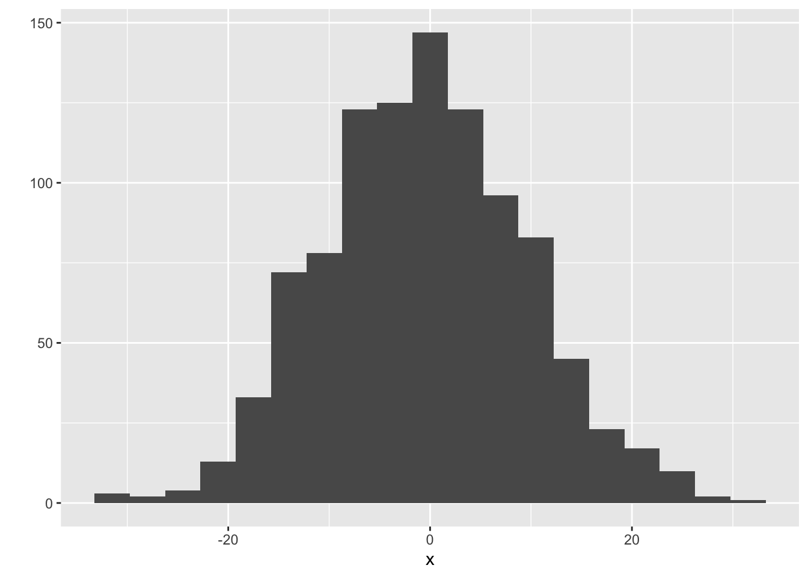
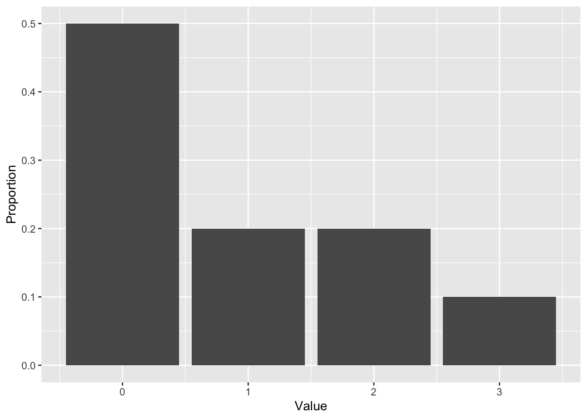

# Regression on an entire distribution: Probabilistic Forecasting

**Caution: in a highly developmental stage! See Section  \@ref(caution).**


```r
suppressPackageStartupMessages(library(tidyverse))
```

```
## Warning: package 'ggplot2' was built under R version 3.5.2
```

```
## Warning: package 'tibble' was built under R version 3.5.2
```

```
## Warning: package 'purrr' was built under R version 3.5.2
```

```
## Warning: package 'dplyr' was built under R version 3.5.2
```

```
## Warning: package 'stringr' was built under R version 3.5.2
```

```r
baseball <- Lahman::Teams %>% tbl_df %>% 
  select(runs=R, hits=H)
```


Up until now, we've only seen different ways of using a predictor to give us more information the __mean__ and __mode__ of the response. The world holds a huge emphasis on the mean and mode, but these are not always what's important. Two alternatives are:

1. __Probabilistic forecasting__
2. __Quantile Regression__ (numeric response only)

## Probabilistic Forecasting: What it is

The idea here is to put forth an _entire probability distribution_ as a prediction. 

Let's look at an example. Suppose there are two baseball teams, one that gets 1000 total hits in a year, and another that gets 1500. Using "total hits in a year" as a predictor, we set out to predict the total number of runs of both teams. Here's the top snippet of the data:


```r
baseball
```

```
## # A tibble: 2,835 x 2
##     runs  hits
##    <int> <int>
##  1   401   426
##  2   302   323
##  3   249   328
##  4   137   178
##  5   302   403
##  6   376   410
##  7   231   274
##  8   351   384
##  9   310   375
## 10   617   747
## # … with 2,825 more rows
```

Let's not concern ourselves with the _methods_ yet. Using a standard regression technique, here are our predictions:


```r
r <- 20
datsub <- filter(baseball,
                 (hits>=1000-r & hits<=1000+r) |
                     (hits>=1500-r & hits<=1500+r)) %>% 
    mutate(approx_hits = if_else(hits>=1000-r & hits<=1000+r, 1000, 1500))
datsub %>% 
    group_by(approx_hits) %>%
    summarize(expected_runs=round(mean(runs))) %>% 
    rename(hits=approx_hits) %>% 
    select(hits, expected_runs)
```

```
## # A tibble: 2 x 2
##    hits expected_runs
##   <dbl>         <dbl>
## 1  1000           558
## 2  1500           768
```

Using a probabilistic forecast, here are our predictions:


Don't you think this is far more informative than the mean estimates in the above table?

The probabilistic forecast/prediction contains the most amount of information about the response as possible (based on a set of predictors), because it communicates the entire belief of what $Y$ values are most plausible, given values of the predictor.

Predictions/forecasts here are called __predictive distributions__.

From @gneiting_raftery:

> Indeed, over the past two decades, probabilistic forecasting has 
> become routine in such applications as weather and climate prediction
> (Palmer 2002; Gneiting and Raftery 2005), computational finance 
> (Duffle and Pan 1997), and macroeconomic forecasting
> (Garratt, Lee, Pesaran, and Shin 2003; Granger 2006).


## Review: Univariate distribution estimates

Let's review how to estimate a univariate probability density function or probability mass function.

### Continuous response

Here's a random sample of 10 continuous variables, ordered from smallest to largest, stored in the variable `x`:


Recall that we can use __histograms__ to estimate the density of the data. The idea is:

1. Cut the range of the data into "bins" of a certain width.
    - For these data, the range is 40. Let's set up four bins of width 10: -19.8 to -9.8, -9.8 to 0.2, etc.
2. Count the number of observations that fall into each bin.
    - For our setup, the number of observations falling into the four bins, in order, are: 3,2,2,3.
3. Make a bar plot (with no space between the bars), where the bar width corresponds to the bins, and the bar height corresponds to the number of observations in that bin.
    - For our setup, we have:
    

```r
ggplot(data.frame(x=x), aes(x)) +
    geom_histogram(binwidth=10, center=min(x)+5,
                   fill="orange", colour="black") +
    theme_bw()
```


(Note: this is not a true density, since the area under the curve is not 1, but the shape is what matters)

You'd have to play with the binwidth to get a histogram that looks about right (not too jagged, not too coarse). For the above example, there are too few data to make a good estimate. Let's now generate 1000 observations, and make a histogram using `qplot` from R's `ggplot2` package, with a variety of binwidths -- too small, too large, and just right.


```r
x <- rnorm(1000, sd=10)
qplot(x, binwidth=1)  # too small
```


```r
qplot(x, binwidth=10)  # too big
```


```r
qplot(x, binwidth=3.5)  # just right
```



__Advanced method__: There's a technique called the _kernel density estimate_ that works as an alernative to the histogram. The idea is to put a "little mound" (a kernel) on top of each observation, and add them up. Instead of playing with the binwidth, you can play with the "bandwidth" of the kernels. Use `geom="density"` in `qplot`, and use `bw` to play with the bandwidth:


```r
qplot(x, geom="density", bw=2.5)
```


### Discrete Response

When the response is discrete (this includes categorical), the approach is simpler:

1. Calculate the proportion of observations that fall into each category.
2. Make a bar chart, placing a bar over each category, and using the proportions as the bar heights.

Here are ten observations, stored in `x`:


```r
x
```

```
##  [1] 1 0 0 0 2 0 1 2 3 0
```

The proportions are as follows:


```r
props <- tibble(Value=x) %>% 
    group_by(Value) %>% 
    summarize(Proportion=length(Value)/length(x))
```

You can plot these proportions with `qplot`, specifying `geom="col"`:


```r
qplot(x=Value, y=Proportion, data=props, geom="col")
```



You can use `ggplot2` to calculate the proportions, but it's more complex. It's easier to plot the raw counts, instead of proportions -- and that's fine, you'll still get the same shape. Using `qplot` again, let's make a plot for 1000 observations (note that I indicate that my data are discrete by using the `factor` function):


```r
set.seed(2)
x <- rpois(1000, lambda=1)
qplot(factor(x))
```


Here's the code to get proportions instead of counts:

```
qplot(factor(x), mapping=aes(y=..prop..), group=1)
```


## Probabilistic Forecasts: subset-based learning methods

### The techniques

The local methods and classification/regression trees that we've seen so far can be used to produce probabilistic forecasts. For local methods, let's ignore the complications of kernel weighting and local polynomials. These methods result in a _subset_ of the data, for which we're used to taking the mean or mode. Instead, _use the subsetted data to plot a distribution_.

- For kNN, form a histogram/density plot/bar plot using the $k$ nearest neighbours.
- For the moving window (loess), form a histogram/density plot/bar plot using the observations that fall in the window.
- For tree-based methods, use the observations within a leaf to form a histogram/density plot/bar plot for that leaf.

The above baseball example used a moving window with a radius of ``20`` hits. Visually, you can see the data that I subsetted within these two narrow windows, for hits of 1000 and 1500:


```r
ggplot(baseball, aes(hits, runs)) +
    geom_point(colour="orange", alpha=0.1) +
    geom_vline(xintercept=c(1000+c(-r,r), 1500+c(-r,r)),
               linetype="dashed") +
    theme_bw() +
    labs(x="Number of Hits (X)",
         y="Number of Runs (Y)")
```


### Exercise

1. Install the `Lahman` package, which contains the `Teams` dataset.
2. Build a null model probabilistic forecast of "number of runs" (`R` column).
3. Build a probabilistic forecast, using kNN, of "number of runs" for a team that has 1500 hits (`H` column) and 70 wins (`W` column). Don't forget to scale the predictors!
4. Do the same thing, but using linear regression. What additional assumption(s) is/are needed here?

### Bias-variance tradeoff

Let's examine the bias-variance / overfitting-underfitting tradeoff with kNN-based probabilistic forecasts. I'll run a simulation like so:

- Generate data from a bivariate Normal distribution, so that $X \sim N(0, 100)$, and $Y = X + N(0, 100)$.
- Training data will contain 500 observations, for which a kNN probabilistic forecast will be built when $X=25$.
- Try both a small (k=15) and large (k=100) value of $k$.
- For each value of $k$, we'll generate 20 training data sets.

Here are the 20 estimates for the values of $k$. The overall mean of the distributions are indicated by a vertical dashed line.


Notice that:

- When $k$ is large, our estimates are biased, because the distributions are not centered correctly. But, the estimates are more consistent.
- When $k$ is small, our estimates are less biased, because the distributions overall have a mean that is close to the true mean. But the variance is high -- we get all sorts of distribution shapes here.

A similar thing happens with a moving window, with the window width parameter. For tree-based methods, the amount that you partition the predictor space controls the bias-variance tradeoff.

### Evaluating Model Goodness

To choose a balance between bias and variance, we need a measure of prediction goodness. When predicting the mean, the MSE works. When predicting the mode, the classification error works. But what works for probabilistic forecasts?

This is an active area of research. The idea is to use a _proper scoring rule_ -- a way of assigning a score based on the forecast distribution and the outcome only, that _also encourages honesty_. We won't go into details -- see [@gneiting_raftery] for details.

_At the very least_, one should check that the forecast distributions are "calibrated" -- that is, the actual outcomes are spread evenly amongst the forecasts. You can check this by applying the forecast cdf to the corresponding outcome -- the resulting sample should be Uniform(0,1). Note that this is built-in to at least some proper scoring rules.

For this course, we won't be picky about how you choose your tuning parameters. Just look for a subset that you think has "enough" observations in it so that the distribution starts to take some shape, but not so much that it starts to shift.

## Discussion Points

For (1) and (2) below, you're choosing between two candidates to hire. Discuss the pros and cons of choosing one candidate over the other in the following situations.

1. Both are predicted to have the same productivity score of 75, but have the following probabilistic forecasts.


> It's hard to make a decision here. On the one hand, we can be fairly certain that the _actual_ productivity of candidate A will be about 75, but there's more of a gamble with candidate B. There's a very real chance that B's productivity is actually quite a bit higher than A -- for example, a productivity of 80 is plausible for B, but not for A. On the other hand, there's also a very real chance that B's productivity is actually quite a bit _lower_ than A, for the same reason. Your decision would depend on whether you would want to take a risk or not.

> On the other hand, in reality, this is only one tool out of many other aspects of the candidate that you would consider. It might be a good idea to chat with B to get a better sense of what their productivity might actually be.

2. Two "non-overlapping" forecasts:


> In this case, B is very very likely to have higher productivity than A, because all "plausible" productivity values for B are higher than all "plausible" productivity values of A.

> Again, this is just one tool you might use to make a decision. 

3. You've formed a probabilistic forecast for a particular value of the predictors, displayed below as a density. You then collect test data for that same value of the predictor, indicated as the points below the density. What is the problem with the probabilistic forecast?


> The forecast is biased, because the actual values are occuring near the upper tail of the distribution -- they _should_ be scattered about the middle, with a higher density of points occuring near 0. If using local methods, we'd have to reduce $k$ or the window width to decrease bias (to remove "further" data that are less relevant); if using a tree-based method, you could grow the tree deeper to lower the bias. 

## When are they not useful?

Probabilistic forecasts are useful if you're making a small amount of decisions at a time. For example:

- Predicting which hockey team will win the Stanley Cup
- Looking at the 2-day-ahead prediction of river flow every day to decide whether to take flood mitigation measures.

But they are not appropriate when making decisions en-masse. For example:

- A bus company wants to know how long it takes a bus to travel between stops, for all stops and all busses.
- You want to predict future behaviour of customers.
