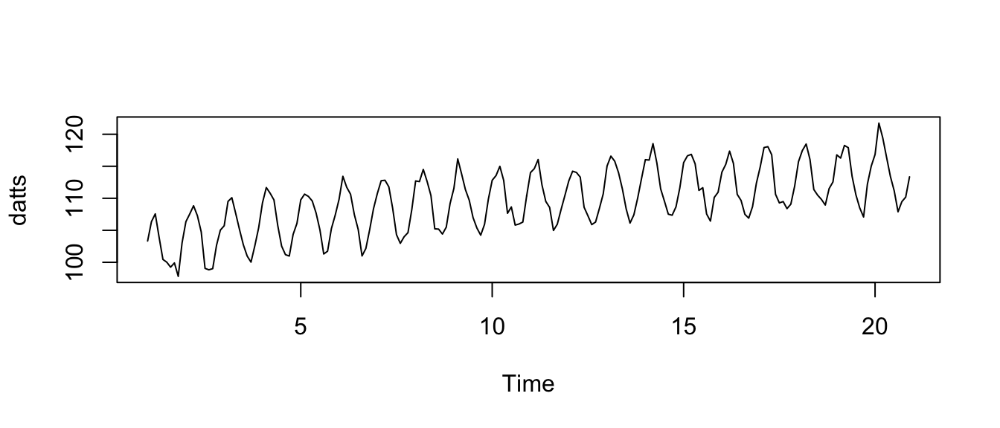

# Regression when order matters: time series and spatial analysis

**Caution: in a highly developmental stage! See Section  \@ref(caution).**

## Timeseries in (base) R

__To add__: `times()` function to extract times from a `ts` object. How to deal with the `start` and `end` arguments when declaring a `ts` object. `tsibble`.

This tutorial demonstrates `timeseries` objects, and `stl` decomposition.

Let's make a periodic time series with a trend. The data can be contained in a vector:


```r
p <- 10
n <- 20*p
dat <- 100 + sqrt(1:n) + 5*sin(1:n * 2*pi/p) + rnorm(n)
```

It's sometimes useful to make an object of type `timeseries`. Do this with the `ts` function in R. But, if there's a cycle, we'll need to indicate that in the `frequency` argument, which is the number of observations per cycle. In this case, the period is 10. 


```r
(datts <- ts(dat, frequency = p))
```

```
## Time Series:
## Start = c(1, 1) 
## End = c(20, 10) 
## Frequency = 10 
##   [1] 103.32889 106.35013 107.56493 103.90212 100.44689 100.02040  99.23977
##   [8]  99.90411  97.80701 103.04150 106.35105 107.54984 108.83248 107.28402
##  [15] 104.74773  99.04764  98.83221  99.00899 102.65845 105.03137 105.70640
##  [22] 109.51352 110.09315 107.64833 105.11708 102.74025 100.98054 100.02756
##  [29] 102.57547 105.38420 109.28836 111.67652 110.79192 109.73707 105.71219
##  [36] 102.52666 101.19743 100.97894 104.35514 106.08092 109.75667 110.64612
##  [43] 110.29309 109.57699 107.70139 105.07604 101.30022 101.73367 105.26116
##  [50] 107.37251 109.83265 113.43234 111.72398 110.63875 107.43417 105.13136
##  [57] 100.99518 102.16019 105.10312 108.37546 110.74573 112.74182 112.81721
##  [64] 111.79372 108.44135 104.31747 102.96235 103.99485 104.63046 108.23121
##  [71] 112.70844 112.60766 114.51234 112.62513 110.42844 105.23155 105.18638
##  [78] 104.41402 105.48675 109.18306 111.56031 116.14705 113.82024 111.36483
##  [85] 109.70297 106.98137 105.36169 104.23700 105.93138 109.86967 112.81569
##  [92] 113.54574 114.99730 112.79152 107.65767 108.65163 105.81281 105.98343
##  [99] 106.28639 110.37149 114.01048 114.63328 116.05280 112.07958 109.50329
## [106] 108.57387 104.97237 105.94653 108.26723 110.45921 112.70742 114.22830
## [113] 114.03421 113.29996 108.59782 107.27047 105.88529 106.29127 108.42358
## [120] 110.68839 115.04421 116.58580 115.79269 113.99425 111.45906 108.32603
## [127] 106.13172 107.40980 110.04083 113.07690 116.02524 115.97180 118.54013
## [134] 115.54017 111.46706 109.52001 107.51757 107.35546 108.65786 111.61801
## [141] 115.57068 116.63465 116.86443 115.38791 111.22910 111.65136 107.54475
## [148] 106.43798 110.13672 110.94354 114.09149 115.29062 117.36761 115.45760
## [155] 110.61333 109.66325 107.49430 106.89842 108.69599 112.34607 114.89838
## [162] 117.92475 118.06219 116.80134 110.62594 109.27855 109.48547 108.38689
## [169] 109.08309 111.90395 115.71773 117.44988 118.47755 116.06137 111.37075
## [176] 110.48622 109.81735 108.94256 111.51192 112.55261 116.78280 116.27828
## [183] 118.25285 117.90620 113.42742 110.53220 108.48663 107.08068 112.21581
## [190] 115.01808 116.84095 121.74166 119.46233 116.41862 113.42014 111.16250
## [197] 107.89265 109.47532 110.18262 113.34804
```

You can plot this object too. You'll get a nice looking time series plot:


```r
plot(datts)
```



And now you can decompose the trend, seasonal component, and error terms with `stl`. Note that `stl` requires a `timeseries` object! Be sure to put `s.window="periodic"` in the `stl` function to use the periodicity of the `timeseries` object. Notice that there are options to change the bandwidths of the loess estimation, along with the degree of the local polynomial, with the `_.degree` and `_.window` arguments.  


```r
fit <- stl(datts, s.window="periodic")
```

The estimates are contained in the `$time.series` part of the output:


```r
head(fit$time.series)
```

```
##        seasonal    trend  remainder
## [1,]  2.9368607 101.0823 -0.6902522
## [2,]  4.7313532 101.3257  0.2931270
## [3,]  5.0377200 101.5690  0.9581829
## [4,]  3.0777250 101.8033 -0.9789428
## [5,] -0.5403572 102.0377 -1.0504015
## [6,] -2.7452879 102.2631  0.5025873
```

## Spatial Example

Rocks were sampled at 54 sites along the
river within a period of two days. The procedure to take one sample
involves taking an underwater photo at a glide site along the river, and
by using computer software, obtaining the lengths of the intermediate
axes of each rock over 8mm in the photo area. To ensure accuracy of
measurements, 25 photos of the same area are taken and combined.


## A Model for River Rock Size

The variable $x$ refers to a location of some distance downstream the
river for example, distance downstream the Meadows campground. For the
54 sample sites, the locations are denoted by $x_{1},\ldots,x_{54}$.
There are three concepts related to rock size.

### 1. Average rock size:

This is the average size of sampled rocks at a location, had that
location been sampled. For location $x$, the value of the sample average
rock size is denoted $m\left(x\right)$. These values are known for 54
sample sites, which are denoted for brevity as $m_{1},\ldots,m_{54}$,
represented as the dots in Figure 

### 2. Mean rock size:

At a particular river location, this can be thought of as the average
rock size in the bed load in the hypothetical situation where the river
flows forever in the same condition as during the sampling period. At
any location, this quantity is unknown, and will thus be referred to as
a "mean" instead of an "average" (an average is a known calculable
quantity). At a location $x$, the mean rock size will be denoted
$M\left(x\right)$, and is represented by the solid line in Figure


### 3. Downstream fining curve:

This can be thought of as an "overall trend" for rock size from upstream
to downstream. The mean rock size $M\left(x\right)$ should "on average"
follow this curve. For location $x$, the value of the downstream fining
curve will be denoted $T\left(x\right)$, represented as the dashed
line in Figure . At any location, this is an
unknown quantity.

## Statistical Objectives


Using the three concepts of rock size in Section, the
following statistical objectives can be pursued to address the
scientific objectives:

1.  Estimate the downstream fining curve $T\left(x\right)$ (i.e. the
    dashed line in Figure) for the range of
    the study area;

2.  Estimate the mean rock size $M\left(x\right)$ (i.e. the solid line
    in Figure) for the range of the study
    area, along with confidence bands

These objectives are addressed in Sections, but first some preliminaries are needed,
discussed in Section.

### Preliminaries: Variance and Correlation

Most of the techniques introduced in Sections require three descriptions of rock size, which
are defined in Section. The
procedure for fitting these descriptions to the data is discussed in
Section . For a detailed review
of these concepts, see Chapter 2 in reference @Geostatistics, for
example.

## Three Concepts

### Error Variance $\sigma_{E}^{2}\left(x\right)$

At location $x$, the error variance is the variability of the average
rock size $m\left(x\right)$ in comparison to the true mean rock size
$M\left(x\right)$. In other words, it is the variance of
$\left(m\left(x\right)-M\left(x\right)\right)$. 

### Mean Variance $\sigma_{M}^{2}$

At location $x$, the mean variance is the variability of the true mean
$M\left(x\right)$ around the downstream fining curve $T\left(x\right)$
(i.e. how "tightly" $M\left(x\right)$ follows $T\left(x\right)$). It may
be reasonable to assume that this variance is constant, unless there is
evidence that this variability changes significantly throughout the
study area. In what follows we will make this assumption; denote the
variance of the true mean rock size as $\sigma_{M}^{2}$.

### Mean Correlation $\rho\left(d\right)$

The mean correlation measures how closely related two mean rock sizes
are at different locations (and equivalently, the average rock sizes at
those locations). The mean rock sizes at two locations immediately next
to each other are expected to be closely related, whereas mean rock
sizes at two locations that are far apart may not be related. A key
assumption used in Sections is *isotropy*, that is, the correlation between mean rock sizes
at two sites only depends on the distance between the sites, and not on
the actual locations along the river. This assumption is of course not
exactly true. For example, the relationship between rocks at sites
upstream and downstream the dam should be different than the
relationship between two equally-spaced sites located without the dam
between them. However, the assumption of isotropy should be viewed as an
approximation to reality.

If $d$ is the distance between two sites, then $\rho\left(d\right)$
denotes the correlation between mean rock sizes at those sites. In
technical terms,
$\rho\left(d\right)=\text{Corr}\left(M\left(x\right),M\left(x+d\right)\right)$
for all $x$, $x+d$ in the study area.

## Estimation

The quantities introduced in Section $\sigma_{E}^{2}\left(x\right)$, $\sigma_{M}^{2}$, and
$\rho\left(d\right)$ are unknown and need to be estimated, because most
of the techniques in Sections use them. There is a relatively simple way to do this
estimation in the case that the error variance,
$\sigma_{E}^{2}\left(x\right)$, is constant, which is discussed in
Section . To account for
the changing error variance, an estimation technique is suggested in
Section, which may
require some manual computations depending on the capabilities of the
software you end up using.

### Constant Error Variance

Although the error variance $\sigma_{E}^{2}\left(x\right)$ is influenced
by sample size $n\left(x\right)$ and distribution variance
$\sigma^{2}\left(x\right)$, approximating the error variance as a
constant should be acceptable if the error variances are small compared
to the mean variance, $\sigma_{M}^{2}$. Then, any differences in
$\sigma_{E}^{2}\left(x\right)$ amongst different locations would be
minuscule relative to $\sigma_{M}^{2}$. Because your sample sizes are
quite large (at least 100), the assumption of small error variances
might be reasonable. However, if that assumption is not close to the
truth, then the error bars described in Section would be overly wide at locations where the error variance
is small (and mean rock size is small), and vice-versa. Since the error
variance is assumed constant here, we will denote it $\sigma_{E}^{2}$,
without the $\left(x\right)$, since it is assumed not to change with
$x$.

One tool that incorporates all the quantities in Section
 is the *variogram*, often
denoted by $\gamma\left(d\right)$. For locations separated by a distance
of $d$, it is defined as half the variance of the difference of the
sample averages at those sites. Using symbols, the variogram is defined
as
$$\gamma\left(d\right)=\frac{1}{2}\text{Var}\left\{ m\left(x\right)-m\left(x+d\right)\right\} ,$$
where "Var" means "variance of". Working out the math, the variogram can
be expressed as
$$\gamma\left(d\right)=\sigma_{M}^{2}\left[1-\rho\left(d\right)\right]+\sigma_{E}^{2},\label{eq:Variogram}$$
which contains all the quantities we need to estimate. Thus, estimating
$\sigma_{E}^{2}$, $\sigma_{M}^{2}$, and $\rho\left(d\right)$ amounts to
estimating the variogram. A plot of the variogram against $d$ might look
something like that in Figure . The bottom dashed line
is called a *nugget*, and the top dashed line is called a *sill*. The
nugget equals $\sigma_{E}^{2}$ and the difference between the sill and
the nugget equals $\sigma_{M}^{2}$.

To estimate a variogram, an *empirical variogram* is typically used (a
"data version" of the variogram). An empirical variogram can be viewed
as a scatterplot, where one point is plotted for each pair of sample
sites. In particular, for two different site numbers $i$ and $j$, a
point is plotted with a vertical value of
$0.5\left(m_{i}-m_{j}\right)^{2}$ and a horizontal value of
$\left|x_{i}-x_{j}\right|$, where $\left|\cdot\right|$ refers to the
absolute value. Then nonlinear regression is used to fit a variogram
model to the data in this scatterplot.

In R, you
will need to specify the "model type". The model type refers to the form
of the mean correlation, $\rho\left(d\right)$. In Figure
, the form is exponential, but there are many other
forms one can choose, including gaussian, matern, or spherical (see
Section 2.5 in Reference @Geostatistics for a discussion of these
models). There is no such thing as a "correct" model, but some may be
good approximations to the truth. You can assess whether a model is a
good approximation by visually checking whether a plot of the fitted
variogram is "close" to the empirical (data) variogram. For a more
formal assessment, you can choose the model that results in the smallest
Akaike Information Criterion (AIC) value, which quantifies a compromise
between model simplicity and goodness-of-fit. Yet another option is to
assess the residual plot, where a "residual" here is the difference
between a point on the empirical variogram and the theoretical
variogram. Although this residual plot is slightly different from
"traditional" residual plots (since the points are not independent),
ensuring the residuals are roughly centered around zero is still useful
for assessing the model fit (you were wondering where an "analysis of
residuals" could be used in your analysis this is one place). If several
models seem to be a good approximation, then it is best to choose the
simplest one (the exponential form is one of the simplest, and most
popular).

### Non-Constant Error Variance

If you fit a variogram model to your data as discussed in Section
, and you find that the
nugget is fairly large in comparison to the sill, then it is
probably not realistic to approximate the error variance by a constant.
This is because the fluctuations in the error variance
$\sigma_{E}^{2}\left(x\right)$ (which we know exist) would no longer be
small relative to the mean variance $\sigma_{M}^{2}$.

In the case that you would like to account for the differences in error
variance, the variogram then depends on the actual locations being
compared, as opposed to just the distance between the locations. For
sites $x$ and $y$, the variogram can be expressed as

$$\gamma\left(x,y\right)=\sigma_{M}^{2}\left[1-\rho\left(\left|x-y\right|\right)\right]+\frac{1}{2}\left[\sigma_{E}^{2}\left(x\right)+\sigma_{E}^{2}\left(y\right)\right].$$

Compared to Equation , the term on the right is no
longer constant. This means that each point in the empirical variogram
(as described at the end of Section ) would have a different nugget and sill; in other
words, they do not come from a common variogram. As such, direct
regression cannot be used to estimate the parameters. However, if we
knew the values of $\sigma_{E}^{2}\left(x\right)$ at the sample sites,
then you could follow these steps to estimate $\sigma_{M}^{2}$ and
$\rho\left(d\right)$:

1.  For all (different) pairs of sites $i$ and $j$, create a modified
    empirical variogram with dependent variable
    $0.5\left(m_{i}-m_{j}\right)^{2}-0.5\left[\sigma_{E}^{2}\left(x_{i}\right)-\sigma_{E}^{2}\left(x_{j}\right)\right]$
    and independent variable $\left|x_{i}-x_{j}\right|$ ;

2.  Choose a form for $\rho\left(d\right)$ this could be exponential,
    gaussian, etc. (see Section 2.5 in Reference @Geostatistics for a
    discussion of these models);

3.  Fit a nonlinear regression model using the mean structure
    $\gamma\left(d\right)=\sigma_{M}^{2}\left[1-\rho\left(d\right)\right]$
    (see Reference @Nonlinear [@Regression] for details on nonlinear
    regression);

Nonlinear regression will provide estimates for $\sigma_{M}^{2}$ and
$\rho\left(d\right)$. As before, an analysis of residuals would be useful here to assess the goodness-of-fit of
the regression.

It only remains to estimate $\sigma_{E}^{2}\left(x\right)$ at the sample
sites. The simplest case is to use the sample variance of the individual
rock sizes at a site, then dividing
by the total number of rocks counted in that sample to get the estimate.

One might believe that the variances of rock size at two sites with
equal means are approximately equal. If this belief is close to the
truth, then there is a more efficient way to estimate the error
variances by "pooling" all of the data. This can be done by simple
regression of the sample variances of the individual rock sizes
(computed by the excel functions or ) against the sample averages. Then
$\sigma_{E}^{2}\left(x\right)$ can be estimated as the value of the
regression curve evaluated at $x$, then dividing by the sample size at
that site.

## Statistical Objective 1: Downstream Fining Curve

regression of
$m_{1},\ldots,m_{54}$ against $x_{1},\ldots,x_{54}$. 
there are two other things you might want to change in the regression.

### Regression Form

there might be a theoretical
form that more accurately describes the curve, such as an exponential
model: $$T\left(x\right)=ae^{-bx}.$$  If such a theoretical model exists, you
may need to consider nonlinear regression, as discussed in Reference
@Nonlinear [@Regression]. If there is no theoretical form, then using a
straight line here is probably a reasonable choice as a rough
approximation.


## Statistical Objective 2: River Profile

The goal of this section is to estimate the mean rock size
$M\left(x\right)$ at a location $x$ along the study site of the river.
Doing this for all locations in the study site, you can obtain a "river
profile" of mean rock size.

*Kriging* is a method of estimating mean rock size $M\left(x\right)$
that takes the variances and correlation of the data into consideration.
In the case when there is no error variance, Kriging will smoothly
"connect the dots" of your data $m_{1},\ldots,m_{54}$. There are many
types of Kriging, but there are two that are directly relevant for this
project Simple Kriging and Universal Kriging. These are discussed in
Sections  and when
approximating the error variance $\sigma_{E}^{2}\left(x\right)$ by a
constant, and in Section  when allowing
the error variance to be non-constant. For a summary of many types of
Kriging, see Reference @arcGIS_Kriging. For an extensive overview of
Kriging, see Chapter 3 in Reference @Geostatistics.

The idea behind ** Kriging is to estimate mean rock size
$M\left(x\right)$ by using a "weighted average" of
$m_{1},\ldots,m_{54}$. That is, instead of using the regular average
$\frac{1}{54}m_{1}+\cdots+\frac{1}{54}m_{54}$, Kriging uses
$w_{1}\left(x\right)m_{1}+\cdots+w_{54}\left(x\right)m_{54}$ to estimate
$M\left(x\right)$, where the weights
$w_{1}\left(x\right),\ldots,w_{54}\left(x\right)$ are nonnegative
numbers adding to 1 that depend on the location $x$. The weights are
chosen to minimize variability in the estimate (technically, the "mean
squared error").

### Simple Kriging

Simple Kriging is Kriging when the downstream fining curve,
$T\left(x\right)$, is known. Of course, the downstream fining curve is
unknown, but you could get an estimate of it, as discussed in Section
. Regarding the implementation of
Kriging, if you are not prompted to specify $T\left(x\right)$, then
whichever software you use will likely assume $T\left(x\right)=0$. In
this case, you would need to adjust for this by subtracting
$T\left(x_{1}\right),\ldots,T\left(x_{54}\right)$ from your data
$m_{1},\ldots,m_{54}$ before running the Kriging procedure, then add
$T\left(x\right)$ to your result.

### Universal Kriging

Universal Kriging is Kriging when the downstream fining curve,
$T\left(x\right)$, is a straight line. In this case, there is no
need to estimate $T\left(x\right)$ separately as in Section
 the estimation is "built-in" to the
procedure. It is best to use Universal Kriging if you choose
$T\left(x\right)$ to be linear and if you do not estimate
$T\left(x\right)$ using GLS.

### Kriging under Non-Constant Error Variance

To implement Kriging, it is likely that most software would use the
variogram estimate in place of the estimates of
$\sigma_{E}^{2}\left(x\right)$, $\sigma_{M}^{2}$, and
$\rho\left(d\right)$. However, if you want to account for
$\sigma_{E}^{2}\left(x\right)$ being different for different locations,
then the Kriging procedure would need to use the individual estimates of
$\sigma_{E}^{2}\left(x\right)$, $\sigma_{M}^{2}$, and
$\rho\left(d\right)$ instead of the variogram itself (recall Section
 for estimating these
quantities under the non-constant error variance consideration). See
Chapter 3 in Reference @Geostatistics to find formulas for the Kriging
estimator.

## Confidence Intervals of the River Profile

Various software that have Kriging capabilities most likely also have
the ability to construct confidence intervals when prompted. A
confidence interval at a location $x$ is an interval that covers the
true mean rock size, $M\left(x\right)$, with approximately some
pre-specified chance (such as 95%). When the intervals are plotted over
a range of locations, they form a confidence "band" around the river
profile.

However, be aware that the confidence intervals in the case of Simple
Kriging will be "too narrow", unless the estimate of the downstream
fining curve is quite precise. A confidence interval that is "too
narrow" has the implication that the amount of confidence you claim
(such as 95%) is actually more than the actual confidence level. This is
because the Simple Kriging procedure treats the downstream fining curve
$T\left(x\right)$ as known, and does not incorporate the uncertainty
involved in estimating $T\left(x\right)$.

It is likely that the confidence intervals provided by the software are
based on the assumption that the data are normally distributed. Since
your data $m_{1},\ldots,m_{54}$ are averages, and there are many rocks
in each site, this assumption of normality is probably reasonable due to
the Central Limit Theorem even though the original rock size
distributions are not normally distributed. However, this relies on the
assumption that the presence of each rock from a sampling site is not
influenced from other rocks (i.e. they are independent). It is not clear
whether this is true, but the influence from other rocks might be small
enough to make independence a reasonable assumption.

As usual, if you decide to account for the non-constant nature of the
error variance $\sigma_{E}^{2}\left(x\right)$, then you may need to
compute the variance of the mean estimate. These formulas are found in
Chapter 3 of Reference @Geostatistics. You can compute a 95% confidence
interval using the variance of the mean estimate (denoting this variance
as $V\left(x\right)$ and the estimated mean as $\hat{M}\left(x\right)$)
by $\hat{M}\left(x\right)\pm1.96\sqrt{V\left(x\right)}$.


<span>1</span> Chilès, J.P., and Delfiner, P. (2012) Geostatistics:
Modeling Spatial Uncertainty. Second Edition. Wiley.

http://help.arcgis.com/en/arcgisdesktop/10.0/help/index.html\#//00310000003q000000

http://www2.sas.com/proceedings/sugi27/p213-27.pdf

Huet, S., Bouvier, A., Poursat, M.-A., and Jolivet, E. (2003)
Statistical Tools for Nonlinear Regression: A Practical Guide with
S-Plus and R Examples. Second Edition. Springer.

Anton, H. (2010) Elementary Linear Algebra. Tenth Edition. Wiley.

